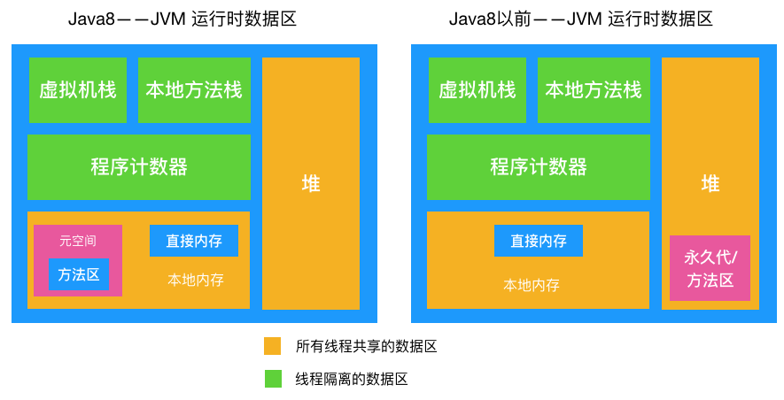

[toc]

# 垃圾回收

Java与C++之间有一堵由 内存动态分配 和 垃圾回收技术 所围成的 "高墙“。

内存无用对象不得到有效回收会造成内存泄露（内存使用完未回收）！所以JVM的垃圾回收极其重要！不过，有了GC同样会出现内存泄露问题：

1. 静态集合类像HashMap、Vector等的使用最容易出现内存泄露，这些静态变量的生命周期和应用程序一致，所有的对象Object也不能被释放，因为他们也将一直被Vector等应用着。
2. 各种连接，数据库连接，网络连接，IO连接等没有显示调用close关闭，不被GC回收导致内存泄露。
3. 监听器的使用，在释放对象的同时没有相应删除监听器的时候也可能导致内存泄露。


## JVM内存区域(JMM)

要搞懂垃圾回收的机制，首先要知道垃圾回收主要回收的是哪块区域的哪些数据，下图是 JVM 的内存区域：（绿色的为线程私有的，生命周期和线程相同）



- 虚拟机栈：描述的是方法执行时的内存模型：每个方法被执行的同时会创建**栈帧**，主要保存执行方法时的**局部变量表**、操作数栈、动态连接和方法返回地址等信息；每个方法从调用到执行完成，就对应着一个栈帧在JVM入帧到出帧的过程（方法执行时入栈，方法执行完出栈），出栈就相当于清空了数据，入栈出栈的时机很明确，所以这块区域**不需要进行 GC**。

  - 局部变量表，存有编译期可知的各种基本类型数据，对象引用类型。局部变量表所需内存空间在编译期间完成分配，当进入一个方法时，这个方法需要在帧中分配多大的局部变量表是完全确定的。
  - 这里可能有两种异常情况：1. 如果线程请求的栈深度大于JVM允许的深度，会抛 StackOverflowError 异常；2. 如果JVM栈动态扩展申请不到足够的内存，会跑出OutOfMenoryErroro异常。其实图中各部分分配不到内存了都会OutOfMenoryErroro异常。。

- 本地方法栈：与虚拟机栈功能非常类似，主要区别在于JVM栈为JVM执行 Java 方法 服务，而本地方法栈为JVM执行本地方法时服务的。这块区域也**不需要进行 GC**。

- 程序计数器：线程独有的， 当前线程执行的字节码的行号记录器（就是记录汇编每行开头指令地址）。

  由于 Java 虚拟机的多线程是通过线程轮流切换并分配处理器的时间来完成的，在任何一个时刻，一个处理器只会执行一个线程，当下次轮到执行被挂起的线程（唤醒线程）时，就要通过程序计数器中的行号指示器知道上次执行到哪了，所以程序计数器的主要作用是记录线程运行时的状态，方便线程被唤醒时能从上一次被挂起时的状态继续执行，需要注意的是，程序计数器是**唯一一个**在 Java 虚拟机规范中没有规定任何 OOM 情况的区域，所以这块区域也**不需要进行 GC**

- 本地内存：所有线程共享的区域。Java 8 中，本地内存，也是我们通常说的**堆外内存**，包含**元空间**和**直接内存**。

  - 在 Java 8 之前有个**永久代**的概念（实际上指的是 HotSpot 虚拟机上的永久代），永久代实现了 JVM 规范定义的**方法区**功能，主要存储**类的信息，常量！，静态变量！，即时编译器编译后代码**等永久的东西，这部分由于是在堆中实现的，受 GC 的管理，不过由于永久代有 -XX:MaxPermSize 的上限，所以如果动态生成类（将类信息放入永久代）或大量地执行 **String.intern** （将字段串放入永久代中的常量区），很容易造成 OOM，很难确定一个合适的大小，受类数量，常量数量的多少影响很大。

  - Java 8 中就把**方法区的实现移到了本地内存中的元空间中**，这样方法区就不受 JVM 的控制了，就不会进行 GC，也方便在元空间中统一管理。在 Java 8 以后这一区域也**不需要进行 GC**，但那这的内存满了怎么释放这里的内存？

  - 方法区(JDK1.7)：Java8后就位于 本地内存的元空间中！！

  - 元数据区(JDK1.8)：默认情况下元数据区域会根据使用情况动态调整，避免了在 1.7 中由于加载类过多从而出现 `java.lang.OutOfMemoryError: PermGen`。但也不能无限扩展，因此可以使用 `-XX:MaxMetaspaceSize`来控制最大内存。

  - 直接内存（堆外内存）：并不是由 `JVM` 虚拟机所管理的一块内存区域。

    NIO通过操作native函数库直接分配堆外内存，然后通过存在Java堆中的DirectByteBuffer对象作为这块内存的引用进行操作。不仅显著提高性能，避免了在Java堆和Native堆中来回复制数据，这样的高效操作也称为`零拷贝`。
    
    既然是内存，那也得是可以被回收的。但由于堆外内存不直接受 `JVM` 管理，所以常规 `GC` 操作并不能回收堆外内存。它是借助于老年代产生的 `fullGC` 顺便进行回收。同时也可以显式调用 `System.gc()` 方法进行回收。

- 堆：堆是 GC 发生的区域！对象实例和数组都是在堆上分配的，GC 也主要对这两类数据进行回收。


## 哪些内存需要回收，如何识别垃圾

上一节我们详细讲述了 JVM 的内存区域，知道了 GC 主要发生在堆，那么 GC 该怎么判断堆中的对象实例或数据是不是垃圾呢，或者说判断某些数据是否是垃圾的方法有哪些。

### 引用计数法

对象被引用一次，在它的对象头上加一次引用次数；如果没有被引用（引用次数为 0），则此对象可回收。不过该方法无法解决一个主要的问题：循环引用！

```
public class TestRC {

    TestRC instance;
    public TestRC(String name) {
    }

    public static  void main(String[] args) {
        // 第一步
        A a = new TestRC("a");
        B b = new TestRC("b");

        // 第二步
        a.instance = b;
        b.instance = a;

        // 第三步
        a = null;
        b = null;
    }
}
```

按步骤画图：


到了第三步，虽然 a，b 都被置为 null 了，但是由于之前它们指向的对象互相指向了对方（引用计数都为 1），所以无法回收，也正是由于无法解决循环引用的问题，所以**现代虚拟机都不用引用计数法来判断对象是否应该被回收**。

### 可达性算法

现代虚拟机基本都是采用这种算法来判断对象是否存活，可达性算法的原理是以一系列叫做  **GC Root** 的对象为起点出发，引出它们指向的下一个节点，再以下个节点为起点，引出此节点指向的下一个结点，通过 GC Root 串成的一条线就叫引用链。

直到所有的结点都遍历完毕，如果相关对象不在任意一个以 **GC Root** 为起点的引用链中，则这些对象会被判断为「垃圾」,会被 GC 回收。两个阶段：

1. 根节点的枚举阶段，不会随着java堆里面存储的对象增加而增加耗时；
2. 标记阶段，耗时随着java堆里面存储的对象增加而增加的。

如图示，如果用可达性算法即可解决上述循环引用的问题：


a, b 对象可回收，就一定会被回收吗？并不是，对象的 finalize 方法给了对象一次垂死挣扎的机会，当对象不可达（可回收）时，当发生GC时，会先判断对象是否执行了 finalize 方法，如果未执行，则会先执行 finalize 方法，我们可以在此方法里将当前对象与 GC Roots 关联，这样执行 finalize 方法之后，GC 会再次判断对象是否可达（这时不会再执行finalize方法），如果不可达，则会被回收，如果可达，则不回收！

那么这些 **GC Roots** 到底是什么东西呢，哪些对象可以作为 GC Root 呢，有以下几类

- 虚拟机栈（栈帧中的本地变量表）中引用的对象
- 方法区中类静态属性（static) 引用的对象
- 方法区中常量 (final) 引用的对象
- 本地方法栈中 JNI（即一般说的 Native 方法）引用的对象

> 虚拟机栈中引用的对象

如下代码所示，a 是栈帧中的本地变量，当 a = null 时，由于此时 a 充当了 **GC Root** 的作用，a 与原来指向的实例 **new Test()** 断开了连接，所以对象会被回收。

```
publicclass Test {
    public static  void main(String[] args) {
	Test a = new Test();
	a = null;
    }
}
```

> 方法区中类静态属性引用的对象

如下代码所示，当栈帧中的本地变量 a = null 时，由于 a 原来指向的对象与 GC Root (变量 a) 断开了连接，所以 a 原来指向的对象会被回收，而由于我们给 s 赋值了变量的引用，s 在此时是类静态属性引用，充当了 GC Root 的作用，它指向的对象依然存活!

```
public class Test {
    public static Test s;
    public static  void main(String[] args) {
	Test a = new Test();
	a.s = new Test();
	a = null;
    }
}
```

> 方法区中常量引用的对象

如下代码所示，常量 s 指向的对象并不会因为 a 指向的对象被回收而回收

```
public class Test {
	public static final Test s = new Test();
    public static void main(String[] args) {
    	Test a = new Test();
    	a = null;
    }
}
```

#### 本地方法栈中 JNI 引用的对象

本地方法就是一个 java 调用非 java 代码的接口，该方法并非 Java 实现的，可能由 C 或 Python等其他语言实现的， Java 通过 JNI 来调用本地方法， 而本地方法是以库文件的形式存放的（在 WINDOWS 平台上是 DLL 文件形式，在 UNIX 机器上是 SO 文件形式）。

当调用 Java 方法时，虚拟机会创建一个栈桢并压入 Java 栈，而当它调用的是本地方法时，虚拟机会保持 Java 栈不变，不会在 Java 栈祯中压入新的祯，虚拟机只是简单地动态连接并直接调用指定的本地方法。


```
JNIEXPORT void JNICALL Java_com_pecuyu_jnirefdemo_MainActivity_newStringNative(JNIEnv *env, jobject instance，jstring jmsg) {
...
   // 缓存String的class
   jclass jc = (*env)->FindClass(env, STRING_PATH);
}
```

如上代码所示，当 java 调用以上本地方法时，jc 会被本地方法栈压入栈中, jc 就是我们说的本地方法栈中 JNI 的对象引用，因此只会在此本地方法执行完成后才会被释放。


## 垃圾回收算法

### 标记清除算法

1. 标记：先根据可达性记数**标记**出相应的可回收对象；
2. 清除：可回收的对象进行回收操作。

不但两步骤效率不高；而且会出现内存碎片！程序后面运行的时候不好分配大对象！

### 复制算法

把堆等分成两块区域, A 和 B，区域 A 负责分配对象，区域 B 不分配, 对区域 A 使用以上所说的**标记法**把存活的对象标记出来（下图有误无需清除），然后把区域 A 中存活的对象都复制到区域 B（存活对象都依次**紧邻排列**）最后把 A 区对象全部清理掉释放出空间，这样就解决了内存碎片的问题了。

不过复制算法的缺点很明显，比如给堆分配了 500M 内存，结果只有 250M 可用，空间平白无故减少了一半！另外每次回收也要把存活对象移动到另一半，效率低下（我们可以想想删除数组元素再把非删除的元素往一端移，效率显然堪忧）


### 标记整理法

标记：和标记清除法一样。

整理：将所有的存活对象都往一端移动，紧邻排列，再清理掉另一端的所有区域，这样的话就解决了内存碎片的问题。

但是缺点也很明显：每进一次垃圾清除都要频繁地移动存活的对象，效率十分低下。

### 分代收集算法

分代收集算法整合了以上算法，综合了这些算法的优点。与其说它是算法，倒不是说它是一种策略，因为它是把上述几种算法整合在了一起。

为啥需要分代收集呢？由于**对象的分布规律**，大部分的对象都很短命，都在很短的时间内都被回收了。

所以分代收集算法根据**对象存活周期的不同**将堆

* 分成新生代和老生代（Java8以前还有个永久代），默认比例为 1 : 2
* 新生代又分为 Eden 区， from Survivor 区（简称S0），to Survivor 区(简称 S1),三者的比例为 8: 1 : 1
* 新生代发生的 GC 称为 Young GC（也叫 Minor GC），老年代发生的 GC 称为 Old GC，收集整个堆的称为 Full GC（导致STW）
* 这样就可以根据新老生代的特点选择最合适的垃圾回收算法了：年轻代用复制算法（因为对象存活少，复制也能很快）！！老年代用标记-清除算法 或  标记-整理算法（对象存活率高，没有额外空间对它进行担保）！！


### ！！内存分配与回收策略

* 对象一般优先分配在 Eden 区；
* 大对象直接进入老年代
* 对象年龄计数，长期存活的将进入老年代

**1、对象在新生代的分配与回收**

对象一般优先分配在 Eden 区，当 Eden 区将满时，触发 Minor GC，经过 Minor GC 后只有少部分对象会存活，它们会被移到 S0 区，同时对象年龄加一（对象的年龄即发生 Minor GC 的次数），最后把 Eden 区对象全部清理以释放出空间，动图如下


当触发下一次 Minor GC 时，会把 Eden 区的存活对象和 S0（或S1） 中的存活对象（S0 或 S1 中的存活对象经过每次 Minor GC 都可能被回收）一起移到 S1（Eden 和 S0 的存活对象年龄+1）, 同时清空 Eden 和 S0 的空间。


若再触发下一次 Minor GC，则重复上一步，只不过此时变成了从 Eden，S1 区将存活对象复制到 S0 区。每次垃圾回收, S0, S1 角色互换，都是从 Eden ,S0(或S1) 将存活对象移动到 S1(或S0)。

也就是说在 Eden 区的垃圾回收我们采用的是**复制算法**，因为在 Eden 区分配的对象大部分在 Minor GC 后都消亡了，只剩下极少部分存活对象，S0,S1 区域也比较小，所以最大限度地降低了复制算法造成的对象频繁拷贝带来的开销。

**2、对象何时晋升老年代**

1. 当对象的年龄达到了我们设定的阈值，则会从S0（或S1）晋升到老年代，如图示：年龄阈值设置为 15， 当发生下一次 Minor GC 时，S0 中有个对象年龄达到 15，达到我们的设定阈值，晋升到老年代！


2. 大对象 当某个对象分配需要**大量的连续内存时**，此时对象的创建不会分配在 Eden 区，会直接分配在老年代，因为如果把大对象分配在 Eden 区,**Minor GC 后再移动到 S0,S1 会有很大的开销**（对象比较大，复制会比较慢，也占空间），也很快会占满 S0,S1 区，所以干脆就直接移到老年代.

3. 动态对象年龄判定：在 S0（或S1） 区相同年龄的对象大小之和大于 S0（或S1）空间一半以上时，则年龄大于等于该年龄的对象也会晋升到老年代。

**3、空间分配担保**

在发生 MinorGC 之前，虚拟机会先检查老年代最大可用的连续空间是否大于新生代所有对象的总空间，如果大于，那么Minor GC 可以确保是安全的；如果不大于，那么虚拟机会查看 HandlePromotionFailure 设置值是否允许担保失败。如果允许，那么会继续检查老年代最大可用连续空间是否大于历次晋升到老年代对象的平均大小，如果大于则进行 Minor GC，否则可能进行一次 Full GC。

**4、Stop The World**

如果老年代满了，会触发 Full GC， Full GC 会同时回收新生代和老年代（清理**整个堆**中的不可用对象），它会导致 Stop The World（简称 STW）,造成挺大的性能开销。此时只有垃圾回收器线程在工作，其他工作线程则被挂起，对外提供不了服务。所以我们要尽量减少 Full GC，甚至避免对象到老年代，到了老年代就只有 Old GC 和 Full GC 才能收拾这些对象了。

现在我们应该明白把新生代设置成 Eden, S0，S1区、给对象设置年龄阈值、默认把新生代与老年代的空间大小设置成 1:2 都是为了**尽可能地避免对象过早地进入老年代，尽可能晚地触发 Full GC**。想想新生代如果只设置 Eden 会发生什么，后果就是每经过一次 Minor GC，存活对象会过早地进入老年代，那么老年代很快就会装满，很快会触发 Full GC，而对象其实在经过两三次的 Minor GC 后大部分都会消亡，所以有了 S0,S1的缓冲，只有少数的对象会进入老年代，老年代大小也就不会这么快地增长，也就避免了过早地触发 Full GC。

由于 Full GC（或Minor GC） 会影响性能，所以我们要在一个合适的时间点发起 GC，这个时间点被称为 Safe Point，这个时间点的选定既不能太少以让 GC 时间太长导致程序过长时间卡顿，也不能过于频繁以至于过分增大运行时的负荷。一般当线程在这个时间点上状态是可以确定的，如确定 GC Root 的信息等，可以使 JVM 开始安全地 GC。Safe Point 主要指的是以下特定位置：

- 循环的末尾

- 方法返回前

- 调用方法的 call 之后

- 抛出异常的位置 另外需要注意的是由于新生代的特点（大部分对象经过 Minor GC后会消亡）， Minor GC 用的是复制算法，而在老生代由于对象比较多，占用的空间较大，使用复制算法会有较大开销（复制算法在对象存活率较高时要进行多次复制操作，同时浪费一半空间）所以根据老生代特点，在老年代进行的 GC 一般采用的是标记整理法来进行回收。

  

## 垃圾收集器分类

如果说收集算法是内存回收的方法论，那么垃圾收集器就是**内存回收的具体实现**（怎么调用垃圾回收算法？）。主要有以下垃圾收集器

- 在新生代工作的垃圾回收器：Serial, ParNew, ParallelScavenge
- 在老年代工作的垃圾回收器：CMS，Serial Old, Parallel Old
- 同时在新老生代工作的垃圾回收器：G1

### 新生代收集器

#### 1. Serial 收集器

Serial 收集器 工作在新生代，采用复制算法，收集时会STW，单线程的垃圾收集器。

看起来单线程垃圾收集器不太实用，不过在 **JVM Client 模式**下，它简单有效（与其他收集器的单线程比），对于限定单个 CPU 的环境来说，无需与其他线程交互，减少了开销，专心做 GC 能将其单线程的优势发挥到极致，另外在用户的桌面应用场景，分配给虚拟机的内存一般不会很大，收集几十甚至一两百兆，STW 时间可以控制在一百多毫秒内，只要不是频繁发生，这点停顿是可以接受的，所以对于运行在 Client 模式下的虚拟机，Serial 收集器是新生代的默认收集器

#### 1. ParNew 收集器

ParNew 收集器是 Serial 收集器的多线程版本，除了使用多线程不同，收集算法，STW，对象分配规则 和 Serial 收集器完全一样，在底层上，这两种收集器也共用了相当多的代码，

ParNew 主要工作在 JVM Server 模式，因为服务端对响应时间敏感，多线程可以ParNew 让垃圾回收得更快，减少了 STW 时间；另外还因为除了 Serial  收集器，**只有它能与 CMS 收集器配合工作**。它的垃圾收集过程如下：


#### 2. Parallel Scavenge 收集器

Parallel Scavenge 收集器也是一个使用**复制算法**，**多线程**，工作于新生代的垃圾收集器，看起来功能和 ParNew 收集器一样，它有啥特别之处吗

**关注点不同**，Parallel Scavenge 目标是达到一个可控制的吞吐量（吞吐量 = 运行用户代码时间 / （运行用户代码时间+垃圾收集时间）），也就是说 CMS 等垃圾收集器更适合用到与用户交互的程序，因为停顿时间越短，用户体验越好，而 Parallel Scavenge 收集器关注的是吞吐量，所以更适合做后台运算等不需要太多用户交互的任务。

Parallel Scavenge 收集器提供了两个参数来精确控制吞吐量，分别是控制最大垃圾收集时间的 -XX:MaxGCPauseMillis 参数及直接设置吞吐量大小的 -XX:GCTimeRatio（默认99%）

除了以上两个参数，还可以用 Parallel Scavenge 收集器提供的第三个参数 -XX:UseAdaptiveSizePolicy，开启这个参数后，就不需要手工指定新生代大小,Eden 与 Survivor 比例（SurvivorRatio）等细节，只需要设置好基本的堆大小（-Xmx 设置最大堆）,以及最大垃圾收集时间与吞吐量大小，虚拟机就会根据当前系统运行情况收集监控信息，动态调整这些参数以尽可能地达到我们设定的最大垃圾收集时间或吞吐量大小这两个指标。自适应策略也是 Parallel Scavenge  与 ParNew 的重要区别！

### 老年代收集器

#### 1. Serial Old 收集器

上文我们知道， Serial 收集器是工作于新生代的单线程收集器，与之相对地，Serial Old 是工作于老年代的单线程收集器，此收集器的主要意义在于给 Client 模式下的虚拟机使用，如果在 Server 模式下，则它还有两大用途：一种是在 JDK 1.5 及之前的版本中与 Parallel Scavenge 配合使用，另一种是作为 CMS 收集器的后备预案，在并发收集发生 Concurrent Mode Failure 时使用（后文讲述）,它与 Serial 收集器配合使用示意图如下


#### 2. Parallel Old 收集器

Parallel Old 是相对于 Parallel Scavenge 收集器的老年代版本，使用多线程和标记整理法，两者组合示意图如下,这两者的组合由于都是多线程收集器，真正实现了「吞吐量优先」的目标.


#### 1. CMS 收集器

CMS （Concurrent Mark Sweep) 收集器是以实现最短 STW 时间为目标的收集器，如果应用很重视服务的响应速度，希望给用户最好的体验，则 CMS 收集器是个很不错的选择！

CMS 是一个划时代的垃圾收集器，是真正意义上的**并发收集器**，它第一次实现了垃圾收集线程与用户线程同时工作，它采用的是传统的 GC 收集器代码框架，与 Serial,ParNew 共用一套代码框架，所以能与这两者一起配合工作。

我们之前说老年代主要用标记整理法，而 CMS 虽然工作于老年代，但采用的是标记清除法，主要有以下四个步骤


1. 初始标记
2. 并发标记
3. 重新标记
4. 并发清除

**标记**阶段是所有使用**可达性分析算法**的垃圾回收算法的垃圾回收器都有的阶段。如果能够削减"标记"过程这部分的停顿时间，那么收益将是可观的。

从图中可以的看到初始标记和重新标记两个阶段会发生 STW，造成用户线程挂起。初始标记仅标记 GC Roots 能关联的对象，速度很快，并发标记是进行 GC Roots  Tracing 可达性分析的过程，重新标记是为了修正并发标记期间因用户线程继续运行而导致标记产生变动的那一部分对象的标记记录，这一阶段停顿时间一般比初始标记阶段稍长，但**远比并发标记时间短**。

整个过程中耗时最长的是并发标记和标记清理，不过这两个阶段用户线程都可工作，所以不影响应用的正常使用，所以总体上看，可以认为 CMS 收集器的内存回收过程是与用户线程一起并发执行的。

但是 CMS 收集器远达不到完美的程度，要有三个缺点

- CMS 收集器对 CPU 资源非常敏感  原因也可以理解，比如本来我本来可以有 10 个用户线程处理请求，现在却要分出 3 个作为回收线程，吞吐量下降了30%，CMS 默认启动的回收线程数是 （CPU数量+3）/ 4, 如果 CPU 数量只有一两个，那吞吐量就直接下降 50%,显然是不可接受的
- CMS 无法处理浮动垃圾（Floating Garbage）,可能出现 「Concurrent Mode Failure」而导致另一次 Full GC 的产生，由于在并发清理阶段用户线程还在运行，所以**清理的同时新的垃圾也在不断出现，这部分垃圾只能在下一次 GC 时再清理掉（即浮动垃圾）**。
- 同时在垃圾收集阶段用户线程也要继续运行，就需要预留足够多的空间要确保用户线程正常执行，这就意味着 CMS 收集器不能像其他收集器一样等老年代满了再使用，JDK 1.6 默认当老年代使用了92%空间后就会被激活，当然这个比例可以通过 -XX:CMSInitiatingOccupancyFraction 来设置，但是如果设置地太高很容易导致在 CMS 运行期间预留的内存无法满足程序要求，会导致 **Concurrent Mode Failure** 失败，这时会启用 Serial Old 收集器来重新进行老年代的收集，而我们知道 Serial Old 收集器是单线程收集器，这样就会导致 STW 更长了。
- CMS 采用的是**标记清除法**，会产生大量的内存碎片，这样会给大内存分配带来很大的麻烦，如果无法找到足够大的连续空间来分配对象，**将会提前触发 Full GC**，这会影响应用的性能。为此CMS有参数 -XX:+UseCMSCompactAtFullCollection（默认是开启的），用于在 CMS 收集器顶不住要进行 FullGC 时开启内存碎片的合并整理过程，内存整理会导致 STW，停顿时间会变长，还可以用另一个参数 -XX:CMSFullGCsBeforeCompation 用来设置执行多少次不压缩的 Full GC 后跟着带来一次带压缩的。

#### G1（Garbage First） 收集器

G1 收集器是面向服务端的垃圾收集器，主要有以下几个特点

- 像 CMS 收集器一样，能利用多核性能与应用程序线程并发执行。

- 分代收集：分代的概念在G1中依然得到保留。而且G1能独自完成整个堆的收集，而不需要靠其他收集器。

- 与 CMS 相比，不会产生内存碎片：**G1 从整体上看采用的是标记-整理法**，局部（两个 Region）上看是基于复制算法实现的，两个算法收集后提供规整的可用内存，这样有利于程序的长时间运行，分配大对象时不会因为无法找到连续内存而提前出发下次GC。

- 与 CMS 相比，布景降低停顿时间，而且建立了**可预测**的停顿时间模型，用户可以指定期望GC停顿时间。

  G1 将整个Java堆划分为多个大小相等的Region，虽然还保留新生代，老年代的概念，但是**新生代和老年代不再是物理隔离的了，分别都是 n 个不连续的大小相同的 Region。**就不用担心各代要分配多少内存了！！

  除了和传统的新老生代，幸存区的空间区别，Region还多了一个H，它代表Humongous，这表示这些Region存储的是巨大对象（humongous object，H-obj），即**大小大于等于region一半的对象 而且  短期存在的巨型对象**，这样超大对象就直接分配到了老年代，防止了反复拷贝移动。那么 G1 分配成这样有啥好处呢？

  之所以能建立**可预测**的停顿时间模型，是因为**G1可以有计划地避免在整个Java堆中进行全区域的垃圾收集**，分配成各个 Region，方便 G1 跟踪各个 Region 里垃圾堆积的价值大小（回收获得空间大小），在后台根据价值大小维护一个优先列表，根据允许的收集时间，优先收集回收价值最大的 Region（名字由来）。


其实G1有个难题：一个对象分配在某个Region中，可能又与Java堆中任意对象发生引用关系，那在可达性分析的时候岂不是要扫描整个堆确保准确性？这个问题在其他收集器也有，只是G1更明显。解决方案就是每个Region都有一个对应的**Rememered Set**，记录引用信息记录到被引用对象所属的Region的**Rememered Set**之中，进行GC时，在GC根节点的枚举范围中加入**Rememered Set**就可以保证不对全堆进行扫描。

如果不计算**Rememered Set**的操作，G1 收集器的工作步骤大致如下

1. 初始标记
2. 并发标记
3. 最终标记
4. 筛选回收


可以看到整体过程与 CMS 收集器非常类似，筛选阶段会根据各个 Region 的回收价值和成本进行排序，根据用户期望的 GC 停顿时间来制定回收计划。


G1提供了两种GC模式，Young GC和Mixed GC，两种都是Stop The World(STW)的。

**G1 Young GC**

Young GC主要是对Eden区进行GC，它在Eden空间耗尽时会被触发。

在这种情况下，Eden空间的数据移动到Survivor空间中，如果Survivor空间不够，Eden空间的部分数据会直接晋升到年老代空间。Survivor区的数据移动到新的Survivor区中，也有部分数据晋升到老年代空间中。最终Eden空间的数据为空，GC停止工作，应用线程继续执行。

[太麻烦了](https://ouyblog.com/2018/04/G1%E6%94%B6%E9%9B%86%E5%99%A8)


### 实战


# JIT编译

JIT：Just In Time Compiler，一般翻译为即时编译器，这是是针对解释型语言而言的，而且并非虚拟机必须，是一种优化手段，Java的商用虚拟机HotSpot就有这种技术手段。

Java为了跨平台特性，Java代码编译形成 Class 文件中的字节码，虚拟机通过**解释方式**执行字节码命令，比起C++编译成**本地二进制代码**要慢许多。为解决这问题，虚拟机内置了两个运行时编译器，当一段Java代码被调用到一定次数，就会判定为热点代码，交给 JIT编译器 即时编译成本地代码，提高运行速度，设置比C++静态编译的代码优秀（Hosspot虚拟机名字就是这么来的）。这时就有编译方式执行的感觉了。。

 

# 类加载机制

  

jvm 把描述类的数据从 Class 文件加载到内存，并对数据进行校验、解析和初始化，最终形成jvm可以直接使用的 Java 类型的过程。

1、在什么时候才会启动类加载器？

其实，类加载器并不需要等到某个类被 “首次主动使用” 时再加载它，JVM规范允许类加载器在预料某个类将要被使用时就预先加载它，如果在预先加载的过程中遇到了.class文件缺失或存在错误，类加载器必须在程序首次主动使用该类时才报告错误（LinkageError错误）如果这个类一直没有被程序主动使用，那么类加载器就不会报告错误。


## 类加载过程

  


> 加载

加载是类加载过程中的一个阶段，这个阶段会在内存中生成一个代表这个类的java.lang.Class对象，作为方法区这个类的各种数据的入口。

1. ClassLoader通过一个类的完全限定名获取此类的二进制字节流；(可以从任意途径里获取字节流。。)
2. 将字节流所代表的静态存储结构转化成**方法区**的运行时数据结构；
3. 在内存中生成一个代表这个类的Class对象（HotSpot 的 Class对象存放在方法区，作为程序访问方法区中致谢数据结构的外部接口）；

- 隐式加载 new 创建类的实例,
- 显式加载：loaderClass,forName等

这个阶段开发人员可控性最强，可以使用用户自定义的 ClassLocader 去完成，去控制字节流的获取方式。下面的各阶段都是由 JVM 主导。

> 验证

目的在于确保class文件的字节流中包含信息符合当前虚拟机要求，不会危害虚拟机自身的安全，主要包括四种验证：

* 文件格式的验证，验证字节流是否符合 Class 文件格式的规范
* 元数据的验证，
* 字节码验证，
* 符号引用验证。

> 准备

正式为类变量（static修饰的字段变量）分配内存，并且设置该类变量的初始值，（如static int i = 5 这里只是将 i 赋值为0，在初始化的阶段再把 i 赋值为5)，这里不包含final修饰的static ，因为final在编译的时候就已经分配了。

注意 final 常量 在编译的时候就分配到使用它的类的常量池里了，不在这玩。。

> 解析

这里主要的任务是把常量池中的符号引用替换成直接引用。？？

符号引用就是class文件中的：

- CONSTANT_Class_info
- CONSTANT_Field_info
- CONSTANT_Method_info

等类型的常量。

下面我们解释一下符号引用和直接引用的概念：

- 符号引用与虚拟机实现的布局无关，引用的目标并不一定要已经加载到内存中。各种虚拟机实现的内存布局可以各不相同，但是它们能接受的符号引用必须是一致的，因为符号引用的字面量形式明确定义在Java虚拟机规范的Class文件格式中。
- 直接引用可以是指向目标的指针，相对偏移量或是一个能间接定位到目标的句柄。如果有了直接引用，那引用的目标必定已经在内存中存在。


> 初始化

这里是类加载的最后阶段，这里才开始执行类中定义的 java 代码。

如果该类具有父类就进行对父类进行初始化，执行其静态初始化器（静态代码块）和静态初始化成员变量。（前面已经对static 初始化了默认值，这里我们对它进行赋值，成员变量也将被初始化）


## 类加载器

虚拟机设计团队把加载动作放到JVM外部实现，以便让应用程序决定如何获取所需的类，JVM提供了3种类加载器：

- 启动类加载器(Bootstrap ClassLoader)：负责加载 JAVA_HOME\lib 目录中的，或通过-Xbootclasspath参数指定路径中的，且被虚拟机认可（按文件名识别，如rt.jar）的类。
- 扩展类加载器(Extension ClassLoader)：负责加载 JAVA_HOME\lib\ext 目录中的，或通过java.ext.dirs系统变量指定路径中的类库。
- 应用程序类加载器(Application ClassLoader)：负责加载用户路径（classpath）上的类库。

JVM通过双亲委派模型进行类的加载，当然我们也可以通过继承`java.lang.ClassLoader`实现自定义的类加载器。

 


当一个类加载器收到类加载任务，会先交给其父类加载器去完成，因此最终加载任务都会传递到顶层的启动类加载器，只有当父类加载器无法完成加载任务时，才会尝试执行加载任务。

采用双亲委派的一个好处是，比如加载位于 rt.jar 包中的类 java.lang.Object，不管是哪个加载器加载这个类，最终都是委托给顶层的启动类加载器进行加载，这样就保证了使用不同的类加载器最终得到的都是同样一个Object对象。

在有些情境中可能会出现要我们自己来实现一个类加载器的需求，由于这里涉及的内容比较广泛，我想以后单独写一篇文章来讲述，不过这里我们还是稍微来看一下。我们直接看一下jdk中的ClassLoader的源码实现：


### 参考

[看完这篇垃圾回收，和面试官扯皮没问题了](https://mp.weixin.qq.com/s?__biz=MzI5MTU1MzM3MQ==&mid=2247483910&idx=1&sn=28134eb9eea657da0d54337d69230c29&scene=21#wechat_redirect)


解释：

* 并行(Parallel)：多条垃圾收集线程并行工作，而用户线程仍处于等待状态
* 并发(Concurrent)：垃圾收集线程与用户线程一段时间内同时工作(交替执行)