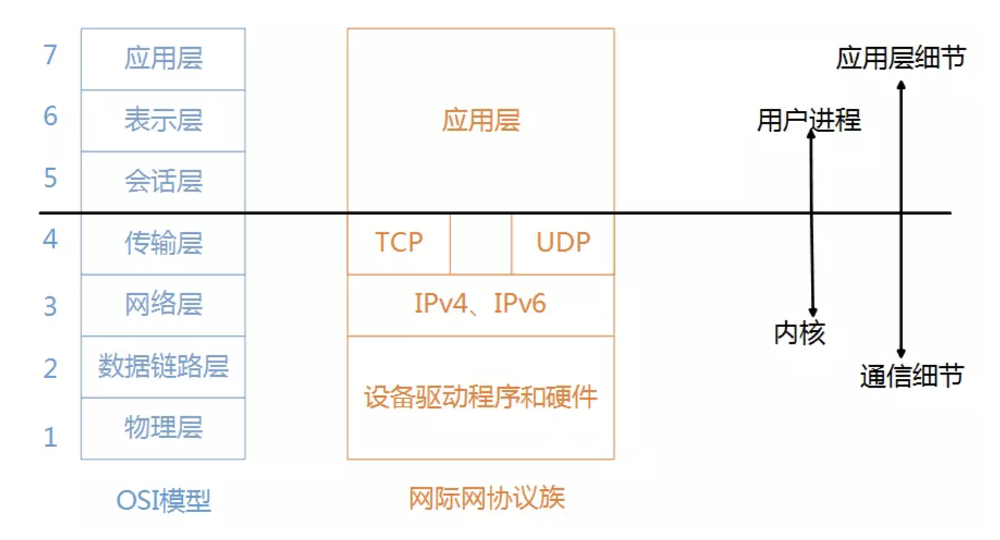
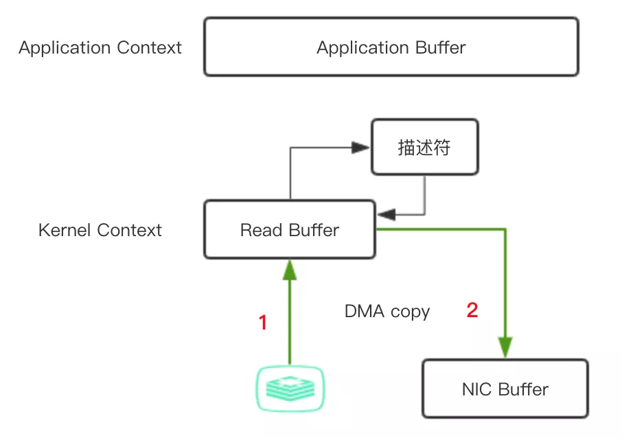

## 先熟悉 TCP/IP 协议

1. 何为TCP协议；
2. 何为Socket通信，Socker通信怎么建立连接；

然后，理解Netty首先要理解NIO，理解NIO首先要理解reactor模型、多路复用select\poll\epoll等等原理。尝试按照这个来详细学习网络编程的来龙去脉。

[系统讲解](https://blog.csdn.net/lemon89/article/details/78290389)

[美团nio](https://tech.meituan.com/2016/11/04/nio.html )

 `IO多路复用`就是通过一种机制，一个进程可以监听多个文件描述符，一个某个描述符就绪（一般是读就绪或写就绪），就能够通知程序进行相应的读写操作。select、poll、epoll本质上都是同步IO，因为他们需要在读写事件就绪后自己负责读写，即这个读写过程是阻塞的，而异步IO则无需自己负责读写，异步IO的实现会把数据从内核拷贝到用户空间。 


## 同步、异步、阻塞、非阻塞

https://baijiahao.baidu.com/s?id=1623908582750588151&wfr=spider&for=pc

https://blog.csdn.net/guanghuichenshao/article/details/79375967

先来个例子理解一下概念，以银行取款为例：

* 同步 ： 自己亲自出马持银行卡到银行取钱（使用同步IO时，Java自己处理IO读写）。

* 异步 ： 委托一小弟拿银行卡到银行取钱，然后给你（使用异步IO时，Java将IO读写委托给OS处理，需要将数据缓冲区地址和大小传给OS(银行卡和密码)，OS需要支持异步IO操作API）。

* 阻塞 ： ATM排队取款，你只能等待（使用阻塞IO时，Java调用会一直阻塞到读写完成才返回）。

* 非阻塞 ： 柜台取款，取个号，然后坐在椅子上做其它事，等号广播会通知你办理，没到号你就不能去，你可以不断问大堂经理排到了没有，大堂经理如果说还没到你就不能去（使用非阻塞IO时，如果不能读写Java调用会马上返回，当IO事件分发器会通知可读写时再继续进行读写，不断循环直到读写完成）。

  

 `阻塞`和`非阻塞`关注的是**应用进程在等待调用结果时的状态**, 而`同步`和`异步`关注的是**通信** 

https://www.cnblogs.com/George1994/p/6702084.html

网络IO的模型大致包括下面几种

同步模型（synchronous IO）
阻塞IO（bloking IO）
非阻塞IO（non-blocking IO）
多路复用IO（multiplexing IO）
信号驱动式IO（signal-driven IO）

异步IO（asynchronous IO）
异步IO

网络IO的本质是socket的读取，socket在linux系统被抽象为流，IO可以理解为对流的操作。对于一次IO访问，数据会先被拷贝到操作系统内核的缓冲区中，然后才会从操作系统内核的缓冲区拷贝到应用程序的地址空间，所以一般会经历两个阶段：

等待所有数据都准备好或者一直在等待数据，有数据的时候将数据拷贝到系统内核；
将内核缓存中数据拷贝到用户进程中；
对于socket流而言：

等待网络上的数据分组到达，然后被复制到内核的某个缓冲区；
把数据从内核缓冲区复制到应用进程缓冲区中；


## BIO

BIO（blocking I/O）（同步阻塞型）还是JDK1.4版本之前常用的编程方式。

BIO服务端从启动到收到客户端数据将会有两次阻塞的过程，可查看项目中BIO实现一个单线程服务器、多线程服务器代码:
1. 服务器端在启动后，首先需要等待客户端的连接请求（第一次阻塞），如果没有客户端连接，服务端将一直阻塞等待；
2. 然后当第一个客户端连接后，服务器会等待客户端发送数据（第二次阻塞），如果客户端没有发送数据，那么服务端将会一直阻塞等待这第一个客户端发送数据，后面连接上的客户端都要干等。

所以，服务实现模式为一个连接一个线程：即客户端有连接请求时，服务端就需要启动一个线程进行处理，如果这个连接不做任务事情就会一直阻塞着，造成不必要的线程开销，

> 缺点：
1. 虽然可以用线程池优化技术，但还是避免不了一个客户端连接请求创建一个线程资源的局面，每个线程都需要一部分内存，内存会被迅速消耗，线程切换的开销也非常大。
2. 连接建立后，如果当前线程暂时没有数据可读，则线程就阻塞在 Read 操作上，造成线程资源浪费。

> 应用：

适用于连接数目比较小且固定的架构，对服务器资源要求比较高，并发局限于应用中。

## NIO

* 用少量的线程去轮询 Selector 上面注册的事件；
* 不就绪的不处理，就绪的拿出来立即执行真正的 I/O 操作。这个使得我们就可以用极少量的线程去 HOLD 住大量的连接， 避免了多线程之间的上下文切换导致的开销 。 

NIO 有三大核心部分Channel(通道)，Buffer(缓冲区), Selector(选择器) 。
* NIO 基于Channel和Buffer进行操作，Channel是双向的，数据总是从通道读取到缓冲区中，或者从缓冲区写入到通道中（BIO 中的 stream 是单向的，FileInputStream 对象只能进行读取数据的操作）。
* 面向缓冲区(Buffer)或者块编程：数据读取到一个稍后处理的缓冲区，且可在缓冲区中前后移动，这可以提供非阻塞式的 高伸缩性网络，也就是说缓冲区实现了NIO的非阻塞模式：处理的线程可以去做其他事直到Buffer填充完再来处理。
* NIO的非阻塞模式：使一个线程从某通道发送请求或者读取数据，但是它仅能得到目前可用的数据，如果目前没有数据可用时，就什么都不会获取，不会线程阻塞，直至数据变的可以读取之前，该线程可以继续做其他的事情。
* Selector(选择器，Java的多路复用器)用于实现非阻塞IO，一个线程处理多个通道的事件（比如：连接请求，数据到达等），看看上面是否有通道是准备好的，当通道准备好可读或可写，然后才去开始真正的读写。

### NIO三大核心

三大核心**接口**使用可参考：[javadoop](https://www.javadoop.com/post/java-nio)

> 应用 

NIO方式适用于连接数目多且连接比较短（轻操作）的架构，比如聊天服务器，弹幕系统，服务器间通讯等。 


### Selector底层
NIO 中 Selector 是对底层操作系统的**IO复用模型**实现的一个抽象。

Unix网络编程讲了5种IO模型：

* 阻塞I/O(blocking I/O)
* 非阻塞I/O(non-blocking I/O)
* I/O复用(I/O multiplexing) 
* 信号驱动式I/O(signal-driven I/O)
* 异步I/O(asynchronous I/O)

所有的I/O模型都要经历2个阶段，即**数据准备**和**内核拷贝数据到应用进程**。异步I/O模型虽然效率高，但是编程复杂，在实际用的不算多。前四种模型的区别主要在第一阶段数据准备，第二阶段拷贝数据都会阻塞。

I/O多路复用是使用最广泛的I/O模型，内核帮助你完成了Event Loop, 你select之后得到的就是
已经准备就绪的fd集合.

#### 相关概念

> 用户进程、内核

用户进程和内核是以传输层为分割线，传输层以上（不包括）是指用户进程（跑应用程序），传输层以下（包括）是指内核。下四层处理所有的通信细节、发送数据、等待确认、给无序到达的数据排序等等。这四层也是通常作为操作系统内核的一部分提供。




* 历史上没有Socket和select之前，全靠进程的fork来完成进程之间的通信，一个负责读一个负责写，还经常有同步问题。
* select（window）：上世纪 80 年代就实现了，它支持注册 FD_SETSIZE(1024) 个 socket，在那个年代肯定是够用的，不过现在嘛，肯定是不行了。(我们也不必觉得 Windows 很落后，在 Windows 中 IOCP 提供的异步 IO 是比较强大的。)

* poll（linux）：1997 年，出现了 poll 作为 select 的替代者，最大的区别就是，poll 不再限制 socket 数量。
* select 和 poll 都有一个共同的问题，那就是它们都只会告诉你有几个通道准备好了，但是不会告诉你具体是哪几个通道，还是需要自己进行一次扫描，一旦通道的数量是几十万个以上的时候，扫描一次的时间都很可观了，时间复杂度 O(n)。
* epoll：2002 年随 Linux 内核 2.5.44 发布，epoll 能直接返回具体的准备好的通道，时间复杂度 O(1)。
* 毕竟 JVM 就是这么一个屏蔽底层实现的平台，我们面向 Selector 编程就可以了！！！

> select
理解了 select 就抓住了 I/O 多路复用的精髓，对应的操作系统中调用的则是系统的 select 函数。

* select是一个阻塞函数：如果select没有查询到到有数据的请求，那么将会一直阻塞。
* 假如有五个请求，系统select会将五个请求从用户态空间全量复制一份到内核态空间，在内核态空间来判断每个请求是否准备好数据，避免了4次频繁的上下文切换。
* 如果有一个或者多个请求已经准备好数据了，那么select将会先将有数据的文件描述符置位，然后select返回。返回后通过遍历查看哪个请求有数据。

select的缺点：
* 底层存储依赖bitmap，处理的请求是有上限的，为1024。
* 文件描述符是会置位的，如果当被置位的文件描述符需要重新使用时，需要重新赋空值。
* fd（文件描述符）从用户态拷贝到内核态仍然有一笔开销。
* select返回后还要再次遍历，来获知是哪一个请求有数据。

> poll函数

poll的工作原理和select很像，先来看一段poll内部使用的一个结构体。
struct pollfd{
    int fd;
    short events;
    short revents;
}

* poll同样会将所有的请求拷贝到内核态，和select一样，poll同样是一个阻塞函数，
* 当一个或多个请求有数据的时候，也同样会进行置位，但是它置位的是结构体pollfd中的events或者revents置位，而不是对fd本身进行置位
所以在下一次使用的时候不需要再进行重新赋空值的操作。
* poll内部存储不依赖bitmap，而是使用pollfd数组的这样一个数据结构，数组的大小肯定是大于1024的。解决了select 1、2两点的缺点。

> epoll函数

epoll是最新的一种多路IO复用的函数。

* 它的fd是共享在用户态和内核态之间的，所以可以不必进行从用户态到内核态的一个拷贝，这样可以节约系统资源；

* 在select和poll中，如果某个请求的数据已经准备好，它们会将所有的请求都返回，供程序去遍历查看哪个请求存在数据，但是epoll只会返回存在数据的请求

* 这是因为epoll在发现某个请求存在数据时，首先会进行一个重排操作，将所有有数据的fd放到最前面的位置，然后返回（返回值为存在数据请求的个数N），那么我们的上层程序就可以不必将所有请求都轮询，而是直接遍历epoll返回的前N个请求，这些请求都是有数据的请求。

  

[netty的epoll]( https://blog.csdn.net/lblblblblzdx/article/details/88795242 )


### 零拷贝

>  零拷贝(Zero-Copy)是指计算机在执行操作时，CPU不需要先将数据从某处内存复制到一个特定区域，从而节省CPU时钟周期和内存带宽 —-维基百科 

在高并发场景下，零拷贝的提升是很关键的，著名框架`Netty`, `Kafka`都大量使用了零拷贝的API，是其高性能的原因之一。 

先看**传统IO网络文件传输**过程，`File.read(file, buf, len);   Socket.send(socket, buf, len);`是这样的：

1. 应用程序中调用 read() 方法，这里会涉及到一次上下文切换（用户态->内核态）；底层采用 DMA read 读取磁盘文件 到 内核缓冲区（ direct memory access直接内存拷贝，不使用CPU copy而直接与系统内存交换数据）
2.  `read()` 调用的返回引发一次上下文切换（内核态->用户态） ；由于应用程序无法访问内核地址空间的数据 ，CPU copy 内核缓冲区数据 到 应用进程缓冲区 (JVM)； 
3.  最终目的是把文件内容通过Socket传到另一个服务中，调用Socket的 `send()`方法，又涉及到一次上下文切换（用户态->内核态）； 同时，文件内容被进行第三次拷贝，从应用进程缓冲区 CPU copy 数据 到 socket缓冲区
4.   `send()`调用返回，引发第四次的上下文切换，同时进行第四次拷贝 ；同时  socket缓冲区 DMA copy 数据给网卡发送

 这种方式一共涉及了4次上下文切换，4次数据拷贝 ，有2次copy是没必要的（2和3），平白增加2次**用户态和内核态上下文切换**, 在高并发场景下会很致命。 

![img](data:image/png;base64,R0lGODlhpAFwAeYAAICAgH9/fwAAAIbYpT8/P0BAQL+/v8DAwPaOkiMfIPDw8G9vb7G+xV9fXxAQEN/f3w8PD+Dg4FJUV7CwsKCgoGBgYDAwMM/Pz+/v79DQ0O0cJC8vL3BwcJ+fn1pXWCAgIB8fH6+vr1BQUP7y8k9PT+4qMpCQkPvHyfJVW4KJjg2xS/zV1/3j5JGPkI+Pjzo5O/BHTfiqrUZGSe84Py4sLfRxdsnIyPm5u/NjafWAhPecoKWxt6XivHZ8gJmkqtXm72jOj9Lx3uTk5MnZ4Z+dnmpuciu7YjEtLvH69I2WnF5hZT87PL3M09bW1vLy8krFeGhlZru6ulnJgxy2VjvAbXZzdJbdscPs00xJSoSBgq2srLTnx46Bgh1DKg4BAh0DBONTWUoIC/zi46QhJqY+QuFES4tXWZc8P94aIeH0/f///wAAAAAAAAAAAAAAAAAAAAAAAAAAAAAAAAAAAAAAAAAAAAAAAAAAAAAAAAAAAAAAAAAAAAAAAAAAAAAAAAAAACH5BAAAAAAALAAAAACkAXABAAf/gGqCg4SFhoeIiYqLjI2Oj5CRkpOUlZaXmJmTTjadnUQtoaKjoVqenZqpqqusra6vsLGys4dNNqBVHh5HCb0Svy8JNL/ExcQ0CTK/Mr0JS7pZLUQ2TbTW19jZ2tvcsk1aWR5LCS/lMsM0LxLMzcPG78XNvcrpEsnpyM8tUULd/v8AAwoc+KhJi13lyqUT9itFCh8MIqaZSLGixYsWIzJIkqLHr3nJZLygcQQKkX4EU6pcybJlJCEtlryQQTOZkhQ7mGDcybOnzzQMdqRQMpLmSCxEnLhcyrSp02wtEigR+aLHjh8/s2rdOnGIjyL1JByJ8rSs2bNoH7WQsUPdDq5w/+Nm9TFzBw2yafPq3cv0yJChcgMLxvhDgo8dUPgqXsy4W4I0SWQMGUxZMAMaET003sy5M6vHaXokKPK2smmfP3xIoOEDqGbPsGPLbgQ6zZAeI5UkYXC69w8GKezJSILV9ezjyI/Xpui1CDN1KXbr7P0zYsfVCSRYLU6Rwevk4MMvXo6RidAiEoIl+9XDIU6N8C3+hh/Rh3v06edpT8FgMk/v4gUoIFrkaaWRe8G9w4488Nzk0G4MTMcVgANWaGFLBVKnYU8UXujhh/9kuOGIGX0H4oko0iIiiSx2mOKLMK6yIosjuhjjjThOMiONGtqY449AJrIjj735GOSRRw5JpP9pRiLpJI5KLklZk09WmWKUUlpmopVcXpkljVR2KeaAWH4ZV5hjpglemWZOuKWacIbHZpsGvhnnnbPNSWd1duLpZ2d67slhn38WOp6g1KFp6CoAALDoLIEiipGiyEUgAAWTHCCAIAIcAEkGE6ihKSaNblOAo4IoYEEFq3SKXKSSlvghBxZYkOmmoioAyalqKODpJaVqw6saGXzAaqu/5hkrk4SCp4ADEXyQbAYRHAAApoIcoAAFAPw6aq6CRNBoBoNk0Ci2Gayaga/lNhpBqtqaAMC7iASbDa8ZOHBsuPImq223viogL729coutGq4qt2xllM5GQQFqALBvAQU4UID/AMcKUMAHFlwqKq6uUiBArR6LbMHFrF6s8bcVaNwxppqe/IEABBdiLzan5ruvGhM4cDLGnJ5cQMwb06xGtB9UbIGuCSu78GANy2YBppbqqkbFumYgALkaC2KCAx9z6qkDJggCgK0WoDoBrryOqnWoanAAtqZlK/ABqobcfE0BIjjQtBoOYBuBA1xzkK0Add+thgjHKlBA2X/HBuvTUcOmNQeNki1IAYYLkjbCcCvQ6bejC2A1IdUCcPHmjo569iCiH/Dt1XjbXPveGH9Nr6YUU+yAownPzuvIvSeNcLKyTb5w5Z5VkDTFFnzA+iDDJ1u62LMP0rLFIrDd+qaqE3L9//SH6G0N34KIYOvHjbbvafC40o5wBe1fe/yrT0Pd7HGikzuIA6FCnyAAiLCyEct0pDuApfynABGszX8im96oKOAAq2mqWvEbVt5udz5U2c1wlkoWBd4FP+o5SnGCmADXkCe5/GnJQiaQHiEqIIKrCaBbIvgA0wI3AQvUMIFXs8AEDrAxrXXra2wTQQZG9ayhTcB4wuOg2aQ4Cw3mC1MVo8ABukdCb2XQUQC4obU8FjnYKG9ZzOPMBwxYLppx7mIF8B/iZlYBXQFRAS3TGLkA4DchElBkDvhWBi6mLzt+sV5UlIUG1UDBdVWgj3ArIfkAMDMUltEzZ4xVGpOzSLGtxP98j/qMCwOzSeR08n4qAWUoVZFJSZXyOBw4GPX8lxJVrlITrUTUK2/pCFvy8hK5FNQuf7kIXxKTEsHc0zCPiUhmsnKUclmmM203TVxC80z7w5HjIpGBnanCmCrZ5qe8uZlk0kmaA8peI8LXCnCmRJ2MYCcmrwkXdOpFAapzYKpMQDHBASADIigA1Vo2L2JVoAAVeJe5rGauCWwskZZwZyvwybfQ8VOg4fpnQAd6Q4UeNKHEAgBDAeBQFAKKnm66UPQkJoBQWeB3HBCA4TR1t+4dIF161BT9KvYuivXqdxT4gMXaCVFYrLRlLoWpTD9W007hNI46VR20rgaxZ11LqBD/8wwWWoPSrBShChZam9UAYIK10UtkvkrY575lATZWAIRk82nEssoKia5CrGYrq9EYiUC1fs9zboXrRc1G18404Qg98E9XMTIEJSwBJQOSJ2HFJ7tDkk4AmMVsVtdWwckSVRuSnStloxg2hGVWsykUQGdFGxshQGE0pVlsGlJjjyooxUKhlez45Ec6E8hOdv5b29I8W9eiuiK3hd1t20Dm298Gd2RjLSxshEAELGSHP9x52g+EwgwPJOVDeGWkEPeKVtKytYaC4ECoBne2Y4U2FXZVRXgpMN6z9tWEpfXhINR7tN+tirjHcUIUwkEOCUSnP21iAnA8QhIPtMAGtz3R/0pj6qiXAiCmM7WsTCOwtlNdzFP6fVvEfvdZbUz4hmqwMIZLy9sNd1h1rgpxS0dsXM80IQotgMIuGLKf90REQluBj31SgJ9ePKMKD4YsjCiK0V7lE110jWV6MXqAj3qKAiKwGpYV0MA4FncbTMYWRUUA5f1iiwNUtjIjsyyILXeZlhYSQidEoQtdjEMezehCF/DcDCzUGQqhmIYNlFxNbMS30NwYwAAQ3ZRDMzobin70UhwtaWtEutIsoTSmZXHpTdeyxp6+RqdDLRBNk7oVoz71P0ytalWkutXcYDWsM/HqWWdD1ra2RK1zbQ1c83oSu/61LHwtbEgEu9ivIDayG/9x7GV/2dmcXjS0Z6HsaSOi2dbORLWzXQhsczuioP52JLwt7klsu9zkLnckzi3udKv7Eez+trvfvc5w03sR8763IuLN7Xzru5n/1rW0Aw5uglfC3wYfBL+zjfCER8zeDhdEwxO+cGtP3OAVn/bFCZ5xaG884B139sf/HfJlj1zfJUf2ye+d8mKvnN4tF/bL3x3zX89c3TXn9c3LnXNEj4AFjti5uHtezRHAAAFBH3jEIUF0Z64ABhpAOrOVvvReQhzaKygBAlAgdUYI/dtNP+YIRqAGrie96uu+eiLqx/a2u/3tcI+73OdO97rbPe7XMPvU0c50tSNCAAEIvOAHT/j/whv+8IhPvOIXz/jGOz7w8ZuF3r1Odb7v2++HiLyVNB+LyeO78gE/wQnIbvVUcP5Jp3+F5xXx9VCvYAYa0EAJYlB6TaQeSbdvxeoT0XpPowAFZEeABoAeT8wbIvdBQv4qYnCCsye8BisYhAaaX3zTj0n52+j9qU+gAdIX0/iFwH6OxA9p0Ac86zqofSbIfyP2i9r8+r6B1uENfvFdfyXa37TwaU9/64vJ/ZYGf++GACUQfX3nf5dwAQawgAZwAZhwAQ9QCA/ggI6wgBiAAQs4CwBIC/knaSOgATPwe79ngN+HgJZAAKclACCAAScYAIUQAATgCCSAWQ8AAgKwARqI/38CWG4sgAA++IPEV4K2lwkE4IKCUIMN0IIvGIONIAAhoAYGIAAsmIOJEARAwAPa0IHOpmwbaAhFSAgwOAghQAJFOIUYsAAEUIaCcAENQAAh8IVg6IYE0AAU2AEGcIQuGAAC0AAB0ACAd4dsOIcRqAYdcAEk0ABTaAmnhwQ8QAUqYATZt4OWp3D1NwhdWAhwqAYXAAJJqAYBAAELEAAggINqsAEgEAALAAEu+AAQUIQgoIovCAGnSAAQEIFwGIVqgIIbQAAbIAAEYId7CIO1mIug2ImXED9BYAVAYAQq0IwqIAWKFo3SOI3UWI3WeI1PIImT+HCaEANeQIQpSAAsiP8BAkCBagACIfAAJDCIYbgApEiORjgIejiIG7AAuWiEuIgwd5iPG+ACg9AA9kgAJICAybiMzviM15iQCrmQ0XgF21h9l3ACKDADX0CEDWAAIbABAykIUZiCq+gCaOiL9zgImSgIYWiSMXiLILOPIBOOIzmEhsCIjgiJD/lJxscCODB/l0gIcMiKHcCRAsCAC/gArLgBfNiGL5mUKCmPKYmPKwmFIOMCQumAJXmMimCFWFiTn0YJIyB8OUB6O0mS8egCEDCOAuCPaoABdBgApJiLMeiOggCPsTiFIBCQ9uiJT8mPG6kGC/CEVamIWnkWlKYDJYACQYgwRBiPudiJCxD/jK+IAR0QjBsAATjIiq4Ii2Aoi8IYgXq4AA1gg5zCkoIQAr4Ig0GplFYZmGVxaDcwAzBAffaHCQvwk4NwAQQwiB1AhguAm2noArbJgg/QhiEwm4XQAX0piHEJgwFgAExIAA5om4NgAG14kYJAnDCpmk5hVxI5A/x3fPeHndlZYyxQA1rnfd75f+AZnovQlRpQA+aZed+ZnpMGUTFQmIeZCGH5Ifkpn9RGRScwAzMAm4ywnxdCoPwJC+azAigwe5FgoBXioAdaYoIwnuUpCRAqIBcaod+EKl1ZAjVwn4+QoeIhohqqbY5SnyhAgpNAouDBoiUaUWYAAwGKCS6KHDX6/6KSwAJlUALpt36P96NAGqRCOqSKd6M46ggjUAMaQAZcAF9396RQGqVSOqVzd6T/0KEfGnZW+mgxEILUp6VbWk0nIKM3QAhgGqa3lAODgJM8ukFoGnBdqgYjkAMa8JXlU4lvqmoroAFcVwI4AKKUmKf0xgIlEHuvKYSCKm5PF3uxhwDvSU2J+m1Zx6gogAMIIKBuGqn+QKWc2qme+qn1MwjyhwM6AKgAp6ncAHhEuqqs2qquqoei+qgQiarbYKSyEZZnmqe2Ghu4iqe0uqLxSQm5+qa7Chu9+qu1Gqzm5qvICgnF6hnH2qzY8KydEa3Sag3UyhnWeq1U2CXbyq2xgP98E0gJEKgG4zoJ5zoJBpCIi/AADaiJBjCIzgoszAquioB8tMiuj/CFJ+kIGMCE/Wqhd8gIBgABArAALoBZT9ig9Gqv3XoIrEgCtBkJf9kI+XiMA7sIbCkIBHCXFtqwDhuuigCQIQACYBiIRvgAAWCIbsixLmgAtBmcc0iBgfiL5uqHAeCutCmdyEmIBgCDDSCvlhgCbYiWKjsIdsicpyiKcOgCaRizHdABLRt+IBuyr3B7GDCMIJCxKgiQoAiV9eiHfpmHMWiZm2m2ftiAveicYUiaJMCWw0iLb9uKxwcBXmuPF1uEHfCKaSiLKXmKqYi3lBkAE2uJVWu1rXB7HUD/ip5piZ1ImhgoALQJl/z6lm1JAgu4l1+Yj2FolINQl245mpy3h6IbuWLpic3pgiU7hQ8ghVFojlRbcIjrCrdnimnYi1N4mqF5sbhYuaipiX3Yiy+LK2Gou6j7khdriVy7gPHjuyOphynIvPh5uLOrCqlXsIO3AUZovEHJu5viu1VJmh3rAtoLlUtpvGGokse3vHlLti7riRsglOuavLFbCcOKpqnXAMZIiCaLMHdJmlC5sGj4vJb7j2h4l1k7vEvpuYIAuuobfkYYmZE7jrB4kl9ImjSLiPQbm/Zbr9XLKYdAjhmblhDwhAJgt6k4vHWZtgRsrq0YADMonaC4AK+I/7cHq7Ix6LZwa4tOWbd3S8LaCwKneLwvOZkLkIoxuMGGK7sfbL2HMIaGEHgIQ7Q2C5WGiLnV+ZPGeYRtiMUYAIMkEAIdwJi/uMVQqJuDaJ3QiYk8O7EGQAKYS5xmbJ0Y4LQE4AIsuMbwycRNfJ0hOsLmOyDf2sep6ayArMTJEQbUS8iAGQk5K4GKGR5igAbu2cGM7MdW4gUTqaIHeMk0en+E2XWd7MmN7K2C8HQwYKpr58EfnK2bEXk5wKD9R8qlzCWa9584IKt3Ssu1vHmGMAI5iamnyssfi56HUJ92ennETAmq+qrO/MzQXHi3xwIoAAOcDKnLnHagus3c3M1vt/8Iwteju5zNm/Z0hjnO5Ixpc1oCZYrN6Yxp8lfJgfrOngbMMzpF9ExqoYzP+ex6MGDNyubNAj3Q29zPhkCAZ+CrzRzNDN3Qq+rKgvqfYKDLxWzKBm0IXDAG7Lx+ynrRDyd/yVwJEM0YI52npULN1tzLVVLSb2ovOhB1It3RF30z5qzK9yrTBq0369ydIYrT/QxKJ+CnFL3HFu3R8/zLOHDPTejT+exLyOwIYXkBgbewkJCuklCujYCBgBiviWvUZlpULPDPBhgDuryTjbmLlKmvGsuEi8CGXhjJiIABNtiPCtvVXs3P4NymNaCmRC0JrTuwcu2xjRCwiUDYv3sIUcj/gh17tXeN14vwetU8fX0dCYkdnTGLhljMkbrJgicZAmgZiEELhQQwxDwZeB07hY8MhR0QnKoKAnA4hmroibYJ10vd2HY1AigQezPwqDvZih3ArkUJw06oBqTJh6N4vKnogFHIh7T4AHtLtzz5wsetjyh5AWtLi67tiaAoiqSoglJc0V4tUTcAdYxaA+dJCeqIWRswuf2rBg2Ag/V4hOsItBBAgf1owETMk/1LjiY8sGGYj19IjuaIjgiDlivKkAie4AzpkBoqUSNwAzlA3u1Zv5YwnF+bibhovCaJWcaYgiJp2Jn4hbr737iyuR7ughreoAq+4iwejdnIdydwzass/wkjEANQJ86ISQl2SAiRmZQZDsifGJkDe5ZTmd+n+74jnsQlPrzyG4EpPq8EoYWY9nqGatNHLQkrUAPtnOOT8N6EEAIQwJft7eXx3cAhEIafyIIaOQh9aeQcy4Sta8ILm4aBHOBnGZd0SN3MnBLzJszIVqljBwPmPaufjN6tGAIGQJarOLgz+ITFDbdfzIRrLr6meYefGMm06IqkSIswmN0AboSNadxlqefAGuXaOAh0mm0xQHw5gAP1ZoJXPYPePQgyS52ajZxmbJvKPZ2ATYawO5vKybptGLX2uMbWSYhozLGwy7Cm/gg3EHvfdgI1MAMynqkcbcwDQW6EigMa8P9tMUCePD3jmLzSfH7qMIAD3Fdu3Gfl3DjuqFfujZADu53u1rbq0ufn7lzItgzvi/DsOnACLz160zYDrq4GLz3Ujq3vvtzs4MyojIrvvPbsMJDb4T7MCk/uDO8I9G5tPYgA1W7thV7UAuFuGx9xXMjUkQgJPYh2J4/tI3/q29jyIh8QUr6FCu3QOJ/zP8rS3QbzkxjQBB30Qg+l/B6h91tpNb9sRy9pSY9sS/9oTV9sT89oUS9sU49oVf9rV19oWc9rW19NXZ9rXz9NYW9rY+9MZT9rZ89MaQ9ra39Mbd9qb09Mca9qc/9LdX9qd89LeU9qe39LfR9qf79Kge9pgx//SoW/aYf/KImPaYu/KI1faY9vKJEvaZNfKJX/aJf/J5nPaJvvJ52PaJ+PJ6FfaKN/J6VfTacfJ6k/TasPJ63vTK+vJrHPTLOfJrV/TLc/JrlPTLsvJr3/S7/fJcHPS8PPJcV/S8dvJcm/SstfJc0fSs//JNH/KNPvJNW/KNePJNlvKNt/JN1fKN8fJOH/J+MPJOXvJ+f/I+mPJ+ufI+1/J++PI/EfJ/N/I/UPJ/cfI/kPCGqCg4SFhoeIiYqLjI2Oj4QAAJCUlZaXmJmam5wDA5ygoaKjpKWPkqapqqusqTxqnmqvrbS1treNqLi7vL2iQEZSUkZAvsbHyJa6yczN/8dBKtEqQc7V1sbL19rbpFTRVNzh4qTZ4+bnizzRs+jt7orl7/LjSNFI8/jy8fn81UZG/QKO2yewYC8gxQwqdEZwoUNWVqw8nOirIcWLoYJQw8ixlcWOIEOKTPZxJC9JKFOqXMmypcuXMGPKnElTpclqJW/eEhCgp8+fQIMKHUq0qNGjSJMq7SlAZ7OcTmk1jbppKlVsk64as6rVEteuuKCCLfV1rKOyZj1mTWsLLdtEbt+aEiu3at1Gce+Koqv3Ut6+f/tu4iuYUuC7hwtfIqz4bGNDiR9DYixZUWRIBh4QuqBZDefNPS8cwmDg0YXMagwYwNC28t61ru2SErCBEP+BAIJuC8JAQACBDQIaGDKQ2IUAASFIHGdd63JseLCfY3J+VoCLQbrVZP/NnHiHQsQdEVggCDku6tINUU4/CD2j4BA6b8d9QUBnQQGuEyJ+gQSJEIIY8B1+D3QAwm0BBDegCwQQMGCBHRAAYCjusSfIehZWaJkBBJCQG27a4eYCCIwQB8ICDZgXAAHtGbAABAf2tgF5BIAQwIvkGQDBBgEMCIqG7GHIHpCICJCZefOpsWKJAgy4QG1LlldadkaqEQIIzD0gAGkCiDYKkdIJmR6YkJUWAJZJRqlIeAE2pWaVVJp53JxGsvmlhZiIKR2ZhVSpxolJ2hkgeftZFd6bU4L/WGUAG6jmKJdk4blYdJI6NltpqQlg44eCQKBfbh4WimkDUNaWaaJSWtmlIBc0AOlslVai53N8EuKnGimCmF0HwRkQAgEQeDmIiSiaRxwJT8KpKKYbQLDAiywKSmGslMwaW63YCcubkz6GAJwAJAg7yAUE9EcCpmpE2MAD5aqxwIDtqoEBgwS4wBq5kVJ7CqX6wkVrv45Y6xq2JhH8mMCVGSySwoohLBnDIEEsmMOPScyRxXpR3BjGF3Fcl8aKeTyRyG+BXBjJDqGclsmCqayQy2OxDNi/ADMis14wF5RzVzcjttTPQAct9NBG7axVzx/XpPTSTDftdEw128xv1FRX/4101ViDdXXWXEe1dddgj/R12GRzNHbZaD8UQQRpt+3223DHLffcdNdt991456333nz37fffgAcu+GMZHGD4AQoQEsEBGSjOOCEKHDD45MwUQKcAHAwCgAAfEFKBAAVEIoDklJfeSwFrUeBAVgB8IEDjgnzwQeiDfFBBBabnHsoTPNyzCOqEmODAhQVYYIIgGWBOuxoUWKCAAGwbQkEBBRwvCAUioJ64GgBkUAHwakwwwSAmkK773upMAcRGiIAvyPONA1AAB7SbYIH8gxRAgRoVUMqBAxz4X+Y4gDkAOMAC5bGdAJnXOTVE4HXnG8sVPEHBClrwghjMoAY3iMEpSP9DBU8YwBZ8l7/ojI57BTiAABJnPPw5cIXha+Agnje+8FXgeft74fgEgLvwrZCGajCBDCOolQly8IhITOIGPSiNEI6wEO4rj+Tw54AJwM+F/6Oe5WooCBUWwoslVMMJpagGEeDOApkjot7Stz5FRFGFicOfGSnQOfwpAIAoyR4hwDgIPqoBeGMUo+RU90DYqRFvvCNhIqJYABEQj4G3QyEDFQe9GQqghhFwQPJy+MAdpnECVnFAAYZ4SMpRDyUfcED08PfAKkryflBMoyAEaMDQEZADBkSgGB1Qgf+t5XPWK2Xp6KdFAESPeWn8XuIowIEIFOCYgpiAIwkxPe1dj3r/JtjeJb+Xw2hWUpjglIr5CEG/cJqTFYEUhDMvec52zgWaF+KiO+dJz3ra8574zKc+98nPfvrznwANqEAHStCCGvSgCE2oQhfK0IY69KEQjahEJ0rRipIiAiYAgDwXdzhDRu6L27No3whoAcs570KXO6kfBSlSt6EgBiOwmSbVabtH0jRzK01nS8kWAw2UoAYrUIQDumlDmz4yp+PsYvY4sL0DfK8C0aPAAeR3w/BxsXw7dcYJEMDVrnr1q2ANq1jHSlawlkADaNUAChBwg5gOInnw1Nzy+OdIpBYClP37AAJBKQIAWECVf5xd6xBIR3VCMKvM2GpZF8vYxpL1rGld4Wtb9xiX1qHEcpKzKyHQqE4RRMACPVTDBzI3yvddEohCRKxgevrToCJipZEQJfUqQDrNtiepgcSf+4BnRjVwVrV6ealbLTNOBUBVkoawLRltZT7drgV4hDwscNMjgmleaHjILQQQvRlSQfxWtBMAbe1Iq8vnkU6UpJxubDIgygk4VQA5dKEhKjDUA6gutIPAq18doAC+7pdtBRBl65YHTPVaKAMiOI4FuMhMRBjXAQIAYHf7mL3jquEAS40e6uQHgJCCMq4G9lsUB1HOEA9uxOuUp4n/JlX1qHjFMI6xjEcSCAA7)


解决上面这个问题有几个思路：

1. 避免在用户空间与内核空间地址之间拷贝数据
2. 直接I/O: 应用进程直接操作硬件存储！
3. 优化`页缓存`和`应用进程缓冲区`的传输

1和2都是**避免AppContext 和 kernelContext 之间的缓冲区拷贝**, 3是从传输的角度优化，因为DMA进行数据传输基本不需要CPU参与，但是 AppContext 的缓冲区和内核的`页缓存`传输没有类似DMA的手段, 3就是从这个角度优化。

直接I/O和传输优化都涉及到硬件层面我们暂且不讲。

主要讲避免上下文切换和数据来回拷贝，Linux内核提供了：mmap 和 sendfile

#### mmap

mmap: 内存映射文件。通过内存映射，将文件的一段直接映射到内核缓冲区 ，内核和应用进程共享一块内存地址，就可以共享内核数据，不用从内核空间往用户空间拷贝了。

上下文切换减少到两次（调read() 用户到内核，send()完成 内核到应用），拷贝次数减少到三次（DMA2次，CPU1次）


JAVA NIO 通过`FileChannel`来提供`Zero-Copy`的支持。

mmap 通过 `FileChannel.map`  调用的 linux中的 mmap 来实现文件映射， 文件映射成功后返回映射的起始地址addr，看源码底层最终new的实例是DirectByteBuffer ， 但是返回的是MappedByteBuffer，MappedByteBuffer是DirectByteBuffer的父类，MappedByteBuffer 便是 JAVA 中 mmap 文件映射内存的操作类。

`FileChannel.map`的基本用法如下:

```java
/**
 * 测试FileChannel的用法
 */
public class FileChannnelTest {

	public static void main(String[] args) {
		File file = new File("src/com/cris/chapter15/f6/FileChannnelTest.java");
		try (
            // FileInputStream打开的FileChannel只能读取
            FileChannel fc = new FileInputStream(file).getChannel();
            // FileOutputStream打开的FileChannel只能写入
            FileChannel fo = new FileOutputStream("src/com/cris/chapter15/f6/a.txt").getChannel();) {

			// 将FileChannel的数据全部映射成ByteBuffer
			MappedByteBuffer mbb = fc.map(MapMode.READ_ONLY, 0, file.length());
			// 使用UTF-8的字符集来创建解码器
			Charset charset = Charset.forName("UTF-8");
			// 直接将buffer里的数据全部输出！！
			fo.write(mbb);
			mbb.clear();
			// 创建解码器
			CharsetDecoder decoder = charset.newDecoder();
			// 使用解码器将byteBuffer转换为CharBuffer
			CharBuffer decode = decoder.decode(mbb);
			System.out.println(decode);
		} catch (Exception e) {

		}
	}

}
```


#### sendfile

sendfile: **没有映射**，从内核缓冲区直接复制到socket缓冲区。 应用进程没法对读取的数据做任何处理。


这样确实改善了很多，但还没达到零拷贝的要求（还有一次cpu参与的拷贝） ， 如果底层网络接口卡支持收集操作的话，就可以进一步的优化。  

在 Linux 内核 2.4 及后期版本中，针对SockerBuffer 描述符做了相应调整：DMA自带了收集功能，对于用户使用还是一样，但内部操作已经发生了改变。具体过程：

1. 使用 DMA 将文件内容拷贝到内核读取缓冲区。
2. 避免了内容的整体拷贝，**只把包含数据位置和长度信息的描述符追加到套接字缓冲区**，DMA 引擎直接把数据从内核缓冲区传到协议引擎（网卡），从而消除了最后一次 CPU参与的拷贝动作。




NIO中通过`FileChannel`来提供`Zero-Copy`的支持，底层 sendfile 的实现对应到Java层中FileChannel 的 transferTo 方法 ：该方法将数据从 FileChannel 传输到指定的 可写Channel；


>  mmap 和 sendfile 区别

* mmap 2 次上下文切换，3 次数据拷贝；sendFile 需要 2 次上下文切换，最少 2 次数据拷贝。
* mmap 则必须从内核拷贝到 Socket 缓冲区；sendFile 可以利用 DMA 收集方式直接 内核 DMA发到网卡，减少 CPU 拷贝。
* mmap 适合小数据量读写；sendFile 适合大文件传输，对文件数据无修改操作的场景。


上面介绍 零拷贝 ，是 场景一：将一个文件通过网络发送出去

场景二：将应用程序内存中的数据通过网络发送出去（非磁盘上的）：使用 SocketChannel，那就看看 SocketChannel write 的 源码

IOUtil.write中的逻辑分为两个部分：

1. 如果src为DirectBuffer，那么就直接调用writeFromNativeBuffer；
2. 否则src为一个HeapBuffer，先通过getTemporaryDirectBuffer创建一个临时的DirectBuffer，然后将HeapBuffer中的数据拷贝到这个临时的DirectBuffer，最后再调用writeFromNativeBuffer发送数据；

场景三：从网络读数据到Java应用程序

之所以要将场景二和场景三进行分析，是为了引出Java中的堆内内存HeapByteBuffer和堆外内存DirectByteBuffer。 通过上面的的分析，可以确定DirectByteBuffer比HeapByteBuffer的效率高，因为在SocketChannelImpl的分析中，它的拷贝少了一次。

那么还有如下疑问？

1. DirectByteBuffer和HeapByteBuffer是什么？

2. DirectByteBuffer、MappedByteBuffer是什么关系？

3. DirectByteBuffer和map都能减少一次数据的拷贝，它们有什么区别呢？

   

DirectByteBuffer  extend  MappedByteBuffer interface DirectBuffer

### NIO的直接内存（堆外内存）

首先，它的作用位置处于传统IO（BIO）与零拷贝之间，为何这么说？

- 传统IO，可以把磁盘的文件经过内核空间，读到JVM空间，然后进行**各种操作**，最后再写到磁盘或是发送到网络，效率较慢但支持数据文件操作。
- 零拷贝则是直接在内核空间完成文件读取并转到磁盘（或发送到网络）。由于它没有读取文件数据到JVM这一环，因此程序无法操作该文件数据，尽管效率很高！

而直接内存则介于两者之间，效率一般且**可操作文件数据**。

NIO操作Native方法分配堆外内存，然后把真实文件映射到堆外内存中，获得内存地址addr，通过Java堆中的`DirectByteBuffer`对象 记录着一块调用 malloc或mmap申请到的 native memory，作为这块堆外内存的引用进行操作。

`MappedByteBuffer`申请的是堆外内存，因此**不受Minor GC控制**，只能在发生Full GC时才能被回收。

而`DirectByteBuffer`改善了这一情况，同时它实现了DirectBuffer接口，维护一个Cleaner对象来完成内存回收。既可以通过**Full GC**来回收内存，也可以调用`clean()`方法来进行回收！！

```java
// new HeapByteBuffer(capacity, capacity); 
// HeapByteBuffer本质是一个数组，分配在堆内存中（受GC管控，易于回收），又会复制数据到堆外，贼变态
ByteBuffer allocate(int capacity);    

// new DirectByteBuffer(capacity);   直接分配堆外内存
ByteBuffer.allocateDirect(int capacity);  
```


[堆外内存回收](https://blog.csdn.net/aitangyong/article/details/39403031 )

==================

本节 我们具体分析了Selector, SocketChannel, DirectBuffer的底层实现，指出其本质上使用的依然是底层的epoll,poll, select, fcntl这些api，只是jvm做了一层封装而已。后面我们又分析了Linux中的zero copy技术和NIO对它的支持，底层使用的还是mmap和send_file系统调用。


## NIO.2 异步 IO
随 JDK 1.7 发布，包括了引入异步 IO 接口和 Paths 等文件访问接口。

通常，我们会有一个线程池用于执行异步任务，提交任务的线程将任务提交到线程池就可以立马返回，不必等到任务真正完成。而通常是通过传递一个回调函数的方式，任务结束后去调用这个函数得到结果。

同样的原理，Java 中的异步 IO 也是一样的，都是由一个线程池来负责执行任务，然后使用回调或自己去查询结果。

异步 IO 主要是为了控制线程数量，减少过多的线程带来的内存消耗和 CPU 在线程调度上的开销。

**在 Unix/Linux 等系统中，JDK 使用了并发包中的线程池来管理任务**，具体可以查看 AsynchronousChannelGroup 的源码。

在 Windows 操作系统中，提供了一个叫做 [I/O Completion Ports](https://msdn.microsoft.com/en-us/library/windows/desktop/aa365198.aspx) 的方案，通常简称为 **IOCP**，操作系统负责管理线程池，其性能非常优异，所以**在 Windows 中 JDK 直接采用了 IOCP 的支持**，使用系统支持，把更多的操作信息暴露给操作系统，也使得操作系统能够对我们的 IO 进行一定程度的优化。

> 在 Linux 中其实也是有异步 IO 系统实现的，但是限制比较多，性能也一般，所以 JDK 采用了自建线程池的方式。

本文还是以实用为主，想要了解更多信息请自行查找其他资料，下面对 Java 异步 IO 进行实践性的介绍。

总共有三个类需要我们关注，分别是 **AsynchronousSocketChannel**，**AsynchronousServerSocketChannel** 和 **AsynchronousFileChannel**

Java 异步 IO 提供了两种使用方式，分别是**返回 Future 实例**和**使用回调函数**。

> 1、返回 Future 实例

返回 java.util.concurrent.Future 实例的方式我们应该很熟悉，JDK 线程池就是这么使用的。Future 接口的几个方法语义在这里也是通用的，这里先做简单介绍。

- future.isDone();

  判断操作是否已经完成，包括了**正常完成、异常抛出、取消**

- future.cancel(true);

  取消操作，方式是中断。参数 true 说的是，即使这个任务正在执行，也会进行中断。

- future.isCancelled();

  是否被取消，只有在任务正常结束之前被取消，这个方法才会返回 true

- future.get(); 

  这是我们的老朋友，获取执行结果，阻塞。

- future.get(10, TimeUnit.SECONDS);

  如果上面的 get() 方法的阻塞你不满意，那就设置个超时时间。

> 2、提供 CompletionHandler 回调函数

java.nio.channels.CompletionHandler 接口定义：

```java
public interface CompletionHandler<V,A> {

    void completed(V result, A attachment);

    void failed(Throwable exc, A attachment);
}
```

> 注意，参数上有个 attachment，虽然不常用，我们可以在各个支持的方法中传递这个参数值

```java
AsynchronousServerSocketChannel listener = AsynchronousServerSocketChannel.open().bind(null);

// accept 方法的第一个参数可以传递 attachment
listener.accept(attachment, new CompletionHandler<AsynchronousSocketChannel, Object>() {
    public void completed(
      AsynchronousSocketChannel client, Object attachment) {
          // 
      }
    public void failed(Throwable exc, Object attachment) {
          // 
      }
});
```

### AsynchronousFileChannel

网上关于 Non-Blocking IO 的介绍文章很多，但是 Asynchronous IO 的文章相对就少得多了，所以我这边会多介绍一些相关内容。

首先，我们就来关注异步的文件 IO，前面我们说了，文件 IO 在所有的操作系统中都不支持非阻塞模式，但是我们可以对文件 IO 采用异步的方式来提高性能。

下面，我会介绍 AsynchronousFileChannel 里面的一些重要的接口，都很简单，读者要是觉得无趣，直接滑到下一个标题就可以了。

实例化：

```java
AsynchronousFileChannel channel = AsynchronousFileChannel.open(Paths.get("/Users/hongjie/test.txt"));
```

一旦实例化完成，我们就可以着手准备将数据读入到 Buffer 中：

```java
ByteBuffer buffer = ByteBuffer.allocate(1024);
Future<Integer> result = channel.read(buffer, 0);
```

> 异步文件通道的读操作和写操作都需要提供一个文件的开始位置，文件开始位置为 0

除了使用返回 Future 实例的方式，也可以采用回调函数进行操作，接口如下：

```java
public abstract <A> void read(ByteBuffer dst,
                              long position,
                              A attachment,
                              CompletionHandler<Integer,? super A> handler);
```

顺便也贴一下写操作的两个版本的接口：

```java
public abstract Future<Integer> write(ByteBuffer src, long position);

public abstract <A> void write(ByteBuffer src,
                               long position,
                               A attachment,
                               CompletionHandler<Integer,? super A> handler);
```

我们可以看到，AIO 的读写主要也还是与 Buffer 打交道，这个与 NIO 是一脉相承的。

另外，还提供了用于将内存中的数据刷入到磁盘的方法：

```java
public abstract void force(boolean metaData) throws IOException;
```

> 因为我们对文件的写操作，操作系统并不会直接针对文件操作，系统会缓存，然后周期性地刷入到磁盘。如果希望将数据及时写入到磁盘中，以免断电引发部分数据丢失，可以调用此方法。参数如果设置为 true，意味着同时也将文件属性信息更新到磁盘。

还有，还提供了对文件的锁定功能，我们可以锁定文件的部分数据，这样可以进行排他性的操作。

```java
public abstract Future<FileLock> lock(long position, long size, boolean shared);
```

> position 是要锁定内容的开始位置，size 指示了要锁定的区域大小，shared 指示需要的是共享锁还是排他锁

当然，也可以使用回调函数的版本：

```java
public abstract <A> void lock(long position,
                              long size,
                              boolean shared,
                              A attachment,
                              CompletionHandler<FileLock,? super A> handler);
```

文件锁定功能上还提供了 tryLock 方法，此方法会快速返回结果：

```java
public abstract FileLock tryLock(long position, long size, boolean shared)
    throws IOException;
```

> 这个方法很简单，就是尝试去获取锁，如果该区域已被其他线程或其他应用锁住，那么立刻返回 null，否则返回  FileLock 对象。

AsynchronousFileChannel 操作大体上也就以上介绍的这些接口，还是比较简单的，这里就少一些废话早点结束好了。


### Asynchronous Channel Groups

为了知识的完整性，有必要对 group 进行介绍，其实也就是介绍 AsynchronousChannelGroup 这个类。之前我们说过，异步 IO 一定存在一个线程池，这个线程池负责接收任务、处理 IO 事件、回调等。

这个线程池就在 group 内部，group 一旦关闭，那么相应的线程池就会关闭。

当我们调用 AsynchronousServerSocketChannel 或 AsynchronousSocketChannel 的 open() 方法的时候，相应的 channel 就属于默认的 group，这个 group 由 JVM 自动构造并管理。

如果我们想要配置这个默认的 group，可以在 JVM 启动参数中指定以下系统变量：

- java.nio.channels.DefaultThreadPool.threadFactory

  此系统变量用于设置 ThreadFactory，它应该是 java.util.concurrent.ThreadFactory 实现类的全限定类名。一旦我们指定了这个 ThreadFactory 以后，group 中的线程就会使用该类产生。

- java.nio.channels.DefaultThreadPool.initialSize

  此系统变量也很好理解，用于设置线程池的初始大小。

可能你会想要使用自己定义的 group，这样可以对其中的线程进行更多的控制，使用以下几个方法即可：

- AsynchronousChannelGroup.withCachedThreadPool(ExecutorService executor, int initialSize)
- AsynchronousChannelGroup.withFixedThreadPool(int nThreads, ThreadFactory threadFactory)
- AsynchronousChannelGroup.withThreadPool(ExecutorService executor)

至于 group 的使用就很简单了，代码一看就懂：

```java
AsynchronousChannelGroup group = AsynchronousChannelGroup
        .withFixedThreadPool(10, Executors.defaultThreadFactory());
AsynchronousServerSocketChannel server = AsynchronousServerSocketChannel.open(group);
AsynchronousSocketChannel client = AsynchronousSocketChannel.open(group);
```

**AsynchronousFileChannels 不属于 group**。但是它们也是关联到一个线程池的，如果不指定，会使用系统默认的线程池，如果想要使用指定的线程池，可以在实例化的时候使用以下方法：

```java
public static AsynchronousFileChannel open(Path file,
                                           Set<? extends OpenOption> options,
                                           ExecutorService executor,
                                           FileAttribute<?>... attrs) {
    ...
}
```


## 应用

### tomcat


## 其他

### Windows OS环境下使用nc命令，实现TCP方式方式通信

1. 在`nc.exe`所在的目录打开`cmd`， 然后执行`nc.exe -l [IP] -p [端口号]`打开server端，例如`nc.exe -l -p 8989`；（不管写程序还是nc，监听端口时，一定要尽量明确指出IP地址，避免出现一起监听到同一端口而没响应的问题）
2. 另外在`nc.exe`所在的目录打开`cmd`，然后执行`nc [服务器端IP地址] [端口号]`打开client端，例如`nc.exe localhost 8989`
3. 在client端输入字符，可以在server端接到。

使用telnet来连nc server
1. window打开telnet：去卸载软件那里，左边启用或关闭windwow功能里找到telnet client打开；
2. cmd输入`telnet [ip] [port]`即可连接上nc.exe的服务端，然后输入字符实时在服务端显示，telnet就是个像ssh的连接工具。

### 参考

[我不是猪八戒](https://juejin.im/post/5e04ebe9e51d4557ed5439e9#heading-6)

[DirectByteBuffer参考](http://sound2gd.wang/2018/07/21/Java-NIO分析-10-堆外内存管理之DirectBuffer详解/)

[初步看看源码]( https://juejin.im/post/5c1b54d8f265da611510c143 )

[零拷贝技术](https://juejin.im/post/5cad6f1ef265da039f0ef5df)