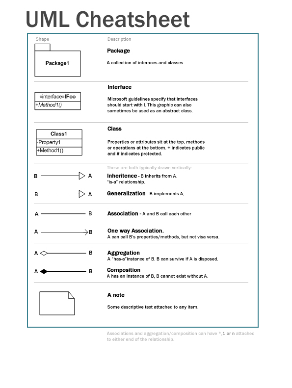

### 四个特性

封装，抽象，继承，多态

接口，抽象类

重载（子类中名字相同而不同方法签名），覆盖重写（对父类方法的不同具体实现）

### UML

[图例](https://github.com/gdhucoder/Algorithms4/blob/master/designpattern/pic/umlcheatsheet.jpg)

=======
## 参考
* <https://github.com/iluwatar/java-design-patternsv>
