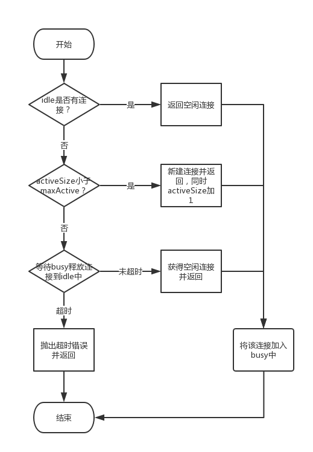

## thriftpool: 自己实现thrift的连接池
需要考虑的：
1. 连接池初始连接数`poolSize`、最小连接数`coreSize`、最大连接数`maxSize`；
2. 没有可用连接时，如果池中的连接数<最大连接数，要考虑主动创建新连接；
3. `client`连接超过`maxIdleSecond`没有被调用，要有额外策略来检查释放闲置连接；
4. 如果`server`端，某个实例挂掉，要考虑将对应的连接置为不可用，或者直接释放；
5. 所有连接都占用，也无法创建新连接时，要有通知机制(邮件、短信之类的都行)及时通知运维人员，提示新增server实例。

另外就是通过一个繁忙队列busy加一个空闲队列idle来做连接池：

参考:
1. https://www.cnblogs.com/yjmyzz/p/thrift-client-pool-demo.html
2. https://www.cnblogs.com/lalalagq/p/10286937.html

和commonpool2框架对比可以发现
* 池化技术该考虑到的`commonpool2`都考虑到了；
* 很多东西可以进行抽象的；

## commonpool: 基于 common-pool2 实现对象池

[common-pool2的使用](https://www.cnblogs.com/lighten/p/7375611.html)

## 连接池问题（连接池 就是一种 对象池）

使用连接池之后就不再是短连接，而是长连接，会有连接失效的问题：
1. 长时间空闲，连接断开？因为网络环境是复杂的，中间可能因为防火墙等原因，导致长时间空闲的连接会断开。
    1. 给连接池中的连接增加最大空闲时间，超时的连接不再使用；
    2. 客户端增加心跳，定时的给服务端发送请求（心跳又讲一大堆！！）
    
2. 当服务端重启之后，导致客户端连接失效，连接失效的特征有：
    1. 对连接进行read读操作时，返回EOF错误
    2. 对连接进行write操作时，返回write tcp 127.0.0.1:52089->127.0.0.1:8002: write: broken pipe错误
    3. 解决方案：客户端在使用的时候需要判断这些失效的连接并丢弃。

