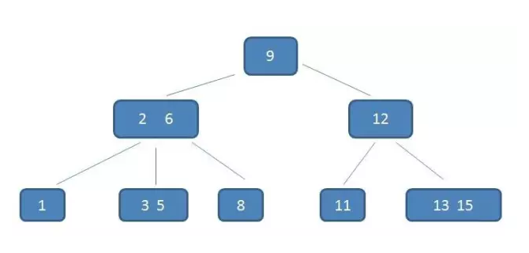
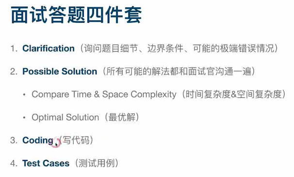
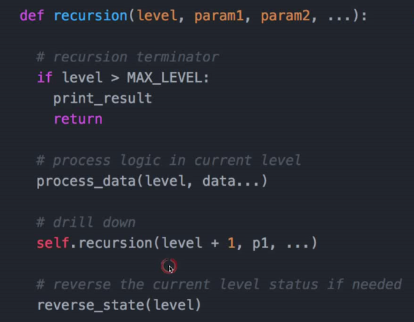
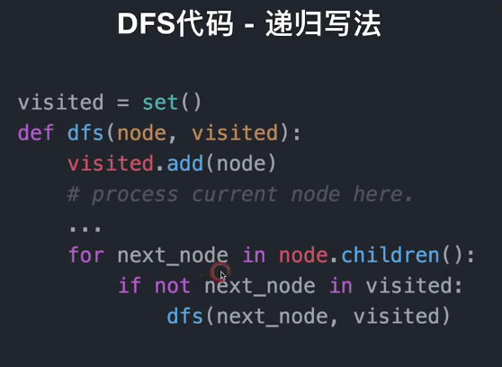
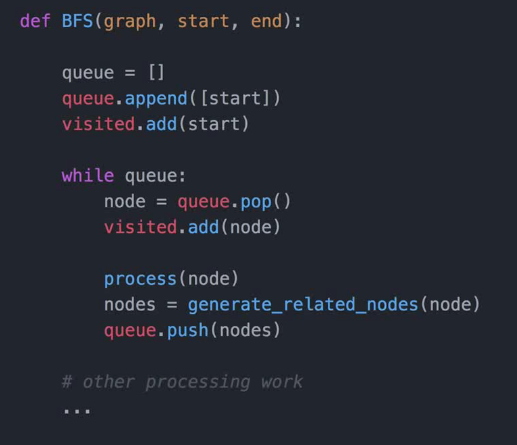
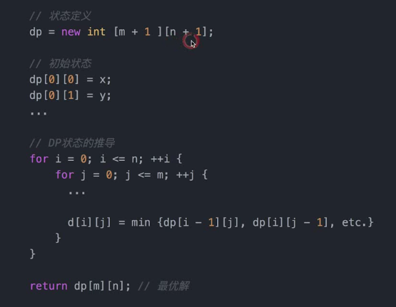
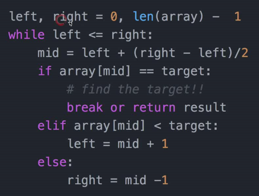

## 数据结构
时间空间复杂度，做完每道题都应该分析一下时间空间复杂度！时间复杂度On2的解法，不足以拿到 Offer

剑指offer：面试前应该熟练掌握链表、树、栈、队列和哈希表等数据结构。如果能对链表的插入和删除节点烂熟于胸，对二叉树的各种遍历方法的循环和递归写法了如指掌，那么真正到了面试的时候也就游刃有余了。同时还会考察查找、排序算法。

### 链表
* 反转链表，两两元素反转，判断链表是否有环
  
### 栈
* 判断括号是否有效20，用栈实现堆232，用堆实现栈225

### 哈希表、Set：用于查询和计数
* 有效的字母异位词242，2Sum1，3Sum15

### 优先队列（正常入，按优先级出）（由小顶堆，大顶堆，二叉搜索树实现）
* 流进的第K个最大的元素703，滑动窗口内最大的数239

* add      增加一个元索，如果队列已满，则抛出一个IIIegaISlabEepeplian异常
* remove   移除并返回队列头部的元素，如果队列为空，则抛出一个NoSuchElementException异常

* offer    添加一个元素并返回true，如果队列已满，则返回false
* poll     移除并返回队列头部的元素，如果队列为空，则返回null
* peek     返回队列头部的元素，如果队列为空，则返回null

* put      添加一个元素，如果队列满，则阻塞
* take     移除并返回队列头部的元素，如果队列为空，则阻塞


### 二叉树，二叉搜索树（左子树小于根结点，右子树大于根节点）
* 验证二叉搜索树98，最小公共祖先235，

### B-tree (Balance tree)
https://mp.weixin.qq.com/s/raIWLUM1kdbYvz0lTWPTvw

https://mp.weixin.qq.com/s/wGqqSFpBnjpytw8J2Sniyw

[树的系统讲解](https://mp.weixin.qq.com/s/q1jZOQyXlcHeboFRCxx_dg)

注意：B-tree 不念 B減樹，而是直接念 Btree。一般像是 MySQL PostgreSQL 都是用 Btree 的方式建立索引。

为什麼用 Btree
用二叉树（二叉搜索树）進行查詢，最快的時間複雜度是 O(logN)，以算法邏輯上面來說，二叉树搜尋的查找速度跟比較次數都是最小的，为什麼还要用 Btree？

我們還需要考量一個現實的問題:磁盘 I/O

数据库的索引都是儲存在磁盘上，當數據量龐大時，索引的大小可能會有幾 G 甚至更多；
查询时我們不可能一次把几G的索引全部加載到內存裡，
由于索引树的每个节点对应每一個磁盘分頁，每查找一次索引节点对应一次磁盘IO
当要查找其中一个索引节点，从根节点出发，最坏情况要经过树的高度次的磁盘IO才能找到。

所以 Btree 的特點就是把「瘦高」的結構變成「矮胖」，來降低 I/O 次數。
Btree是一种多路平衡查找树，每个节点最多包含 k 个孩子（k阶Btree），k 的大小取决于磁盘页的大小。
Btree 每個节点最多可以包容兩個值，就可以在节点內定位省了一次到不同硬碟分頁的時間。

Btree结构：


### B+tree
B+ Tree 特征
每個叶子节点都帶有指向下一個节点的指針，形成有序链表，加速范围查询
只有叶子节点帶卫星数据，父节点只帶关键字与指针，单一节点更省空间，让查询 I/O 變小
所有查询都會查到叶子节点，查询性能穩定

B+ Tree 更加矮胖
B+ Tree 中的内部节点，只存放关键字与子节点的指針，不存其他的 Satellite Information，因此最大化了內部節點的分支因子，所以說以同樣大小的硬碟分頁可以容納更多的節點元素。

換句話說，以數據量相同的情況下， B+ Tree 會比 B-Tree 來的更加矮胖，有效的節省硬碟 I/O 次數。


### trie树（字典树）
说句实话，工程上来说，和hash比起来，trie就是没有用的东西。这个可以说很深刻地表现出了一个学生和一个软件工程师的思维差异。
* hash类的算法都有可能因为碰撞而退化，而trie是稳定的复杂度，简直太招人喜欢了。但是工程师99.9%的情况下都会用hash。
* 因为，hash函数、map、set，都有内置库，所有语言都有。这意味着一个功能用hash就是五行代码，甚至体现不出用了hash，
* 而用trie，你要么先交一份trie开源库的分析选型比较报告来，要么自己撸一个，附带着先写一千行的单元测试用例，再跑个压测。
* 写出简单可用能快速上线的代码要更重要。

### 并查集（union&find）
树型的数据结构，用于处理一些不交集的合并及查询问题。
一开始初始化所有节点为自己指向自己的节点。
Find：确定元素属于哪一个子集。它被用来确定两个元素是否属于同一子集。
Union：将两个子集合并成同一个集合。

## 大数据相关

### hash

[海量数据解决思路之Hash算法](https://blog.51cto.com/zengzhaozheng/1409705)

对大文件进行统计，机器内存又不够，一般就是分而治之。首先就通过 hash 函数进行分，将相同 key 的 hash 到相同的文件！

[july](https://blog.csdn.net/v_july_v/article/details/7382693)，处理海量数据问题，无非就是：

1. 分而治之/hash映射 + hash统计 + 堆/快速/归并排序；
2. 双层桶划分
3. Bloom filter/Bitmap；
4. Trie树/数据库/倒排索引；
5. 外排序；
6. 分布式处理之Hadoop/Mapreduce。


### bitmap

**场景**

给一台普通PC，2G内存，要求处理一个包含40亿个不重复并且没有排过序的无符号的int整数（4字节），给出一个整数，问如果快速地判断这个整数是否在文件40亿个数据当中？问题思考：

1. 40亿个int 占（40亿*4）/1024/1024/1024 大概为14.9G左右，很明显内存只有2G，放不下，因此不可能将这40亿数据放到内存中计算。
2. 如果能够用一个bit位来标识一个int整数那么存储空间将大大减少，算一下40亿个int需要的内存空间为40亿/8/1024/1024/1024大概为476.83 mb，完全可以将这40亿个int数放到内存中进行处理。

具体思路：

1个int占4字节即4*8=32位，那么只需要申请一个int数组长度为 int tmp[1+N/32]即可存储完这些数据，其中**N代表要进行查找的总数**40亿，tmp中的每个元素在内存在占32位可以对应表示十进制数0~31，所以可得到BitMap表:

```
tmp[0]:可表示0~31
tmp[1]:可表示32~63
tmp[2]可表示64~95
```

那么接下来就看看**十进制数如何转换为对应的bit位**，假设这40亿int数据为：6,3,8,32,......，那么具体的BitMap表示为：

```
tmp[0]        00....一共32位....000010100100     3个1分别是  8  6  3
tmp[1]        00....一共32位....000000000001     这个1表示 32
...
tmp[1+N/32]   00....一共32位....000000000000
```

如何判断int数字在tmp数组的哪个下标？
通过直接除以32取整数部分，例如：整数8除以32取整等于0，那么8就在tmp[0]上。
如何知道了8在tmp[0]中的32个位中的哪个位？
这种情况直接mod上32就ok，又如整数8，在tmp[0]中的第8 mod上32等于8，那么整数8就在tmp[0]中的第八个bit位（从右边数起）。java有个bitmap实现就是bitset

### HyperLogLog

**基数计数(cardinality counting)**通常用来统计一个集合中不重复的元素个数（判断是否存在还是要用 bitmap)，例如统计某个网站的UV，或者用户搜索网站的关键词数量。数据分析、网络监控及数据库优化等领域都会涉及到基数计数的需求。 要实现基数计数，最简单的做法是记录集合中所有不重复的元素集合S_u*S**u*，当新来一个元素x_i*x**i*，若S_u*S**u*中不包含元素x_i*x**i*，则将x_i*x**i*加入S_u*S**u*，否则不加入，计数值就是S_u*S**u*的元素数量。这种做法存在两个问题：

1. 当统计的数据量变大时，相应的存储内存也会线性增长
2. 当集合S_u*S**u*变大，判断其是否包含新加入元素x_i*x**i*的成本变大

大数据量背景下，要实现基数计数，首先需要确定存储统计数据的方案，以及如何根据存储的数据计算基数值；另外还有一些场景下需要融合多个独立统计的基数值，例如对一个网站分别统计了三天的UV，现在需要知道这三天的UV总量是多少，怎么融合多个统计值。

#### **基数计数方法**

##### B树

B树最大的优势是插入和查找效率很高，如果用B树存储要统计的数据，可以快速判断新来的数据是否已经存在，并快速将元素插入B树。要计算基数值，只需要计算B树的节点个数。 将B树结构维护到内存中，可以快速统计和计算，但依然存在问题，B树结构只是加快了查找和插入效率，并没有节省存储内存。例如要同时统计几万个链接的UV，每个链接的访问量都很大，如果把这些数据都维护到内存中，实在是够呛。

##### bitmap

bitmap可以理解为通过一个bit数组来存储特定数据的一种数据结构，每一个bit位都能独立包含信息，bit是数据的最小存储单位，因此能大量节省空间，也可以将整个bit数据一次性load到内存计算。 如果定义一个很大的bit数组，基数统计中每一个元素对应到bit数组的其中一位，例如bit数组 001101001001101001代表实际数组[2,3,5,8][2,3,5,8]。新加入一个元素，只需要将已有的bit数组和新加入的数字做按位或 (or)(*o**r*)计算。bitmap中1的数量就是集合的基数值。

bitmap有一个很明显的优势是可以轻松合并多个统计结果，只需要对多个结果求异或就可以。也可以大大减少存储内存，可以做个简单的计算，如果要统计1亿个数据的基数值，大约需要内存： 100000000/8/1024/1024 \approx≈ 12M
如果用32bit的int代表每个统计数据，大约需要内存：
32*100000000/8/1024/1024 \approx≈ 381M

bitmap对于内存的节约量是显而易见的，但还是不够。统计一个对象的基数值需要12M，如果统计10000个对象，就需要将近120G了，同样不能广泛用于大数据场景。

##### 概率算法

实际上目前还没有发现更好的在大数据场景中准确计算基数的高效算法，因此在不追求绝对准确的情况下，使用概率算法算是一个不错的解决方案。概率算法不直接存储数据集合本身，通过一定的概率统计方法预估基数值，这种方法可以大大节省内存，同时保证误差控制在一定范围内。目前用于基数计数的概率算法包括:

- ***Linear Counting(LC)\***：早期的基数估计算法，LC在空间复杂度方面并不算优秀，实际上LC的空间复杂度与上文中简单bitmap方法是一样的（但是有个常数项级别的降低），都是O(N_{max})*O*(*N**m**a**x*)；
- ***LogLog Counting(LLC)\***：LogLog Counting相比于LC更加节省内存，空间复杂度只有O(log_2(log_2(N_{max})))*O*(*l**o**g*2(*l**o**g*2(*N**m**a**x*)))
- ***HyperLogLog Counting(HLL)\***：HyperLogLog Counting是基于LLC的优化和改进，在同样空间复杂度情况下，能够比LLC的基数估计误差更小。

下面将着重讲HLL的原理和计算过程。

#### HyperLogLog的惊人表现

上面我们计算过用bitmap存储1一亿个统计数据大概需要12M内存；而在HLL中，只需要不到1K内存就能做到；redis中实现的HyperLogLog，只需要12K内存，在标准误差0.81%的前提下，能够统计2^{64}264个数据。首先容我感叹一下数学的强大和魅力，那么概率算法是怎样做到如此节省内存的，又是怎样控制误差的呢？

首先简单展示一下HLL的基本做法，HLL中实际存储的是一个长度为m*m*的大数组S*S*，将待统计的数据集合划分成m*m*组，每组根据算法记录一个统计值存入数组中。数组的大小m*m*由算法实现方自己确定，redis中这个数组的大小是16834，m*m*越大，基数统计的误差越小，但需要的内存空间也越大。

这里有个[HLL demo](http://content.research.neustar.biz/blog/hll.html)可以看一下HLL到底是怎么做到这种超乎想象的事情的。


1. 通过hash函数计算输入值对应的比特串
2. 比特串的低 t(t=log_2^m)*t*(*t*=*l**o**g*2*m*)位对应的数字用来找到数组S*S*中对应的位置 i*i*
3. t+1*t*+1位开始找到第一个1出现的位置 k*k*，将 k*k* 记入数组S_i*S**i*位置
4. 基于数组S*S*记录的所有数据的统计值，计算整体的基数值，计算公式可以简单表示为：\hat{n}=f(S)*n*^=*f*(*S*)

看到这里心里应该有无数个问号，这样真的就能统计到上亿条数据的基数了吗？我总结一下，先抛出三个疑问：

1. 为什么要记录第一个1出现的位置？
2. 为什么要有分桶数组 S*S* ？
3. 通过分桶数组 S*S* 计算基数的公式是什么？

#### hyperloglog原理理解

举一个我们最熟悉的抛硬币例子，出现正反面的概率都是1/2，一直抛硬币直到出现正面，记录下投掷次数k*k*，将这种抛硬币多次直到出现正面的过程记为一次伯努利过程，对于n*n*次伯努利过程，我们会得到n*n*个出现正面的投掷次数值k_1*k*1,k_2*k*2……k_n*k**n*，其中最大值记为k_{max}*k**m**a**x*，那么可以得到下面结论：

1. n*n*次伯努利过程的投掷次数都不大于k_{max}*k**m**a**x*
2. n*n*次伯努利过程，至少有一次投掷次数等于k_{max}*k**m**a**x*

对于第一个结论，n*n*次伯努利过程的抛掷次数都不大于k_{max}*k**m**a**x*的概率用数学公式表示为：
P_n(X \le k_{max})=(1-1/2^{k_{max}})^n*P*​*n*​​(*X*≤*k*​*m**a**x*​​)=(1−1/2​*k*​*m**a**x*​​​​)​*n*​​

第二个结论至少有一次等于k_{max}*k**m**a**x*的概率用数学公式表示为：
P_n(X \ge k_{max})=1-(1-1/2^{k_{max}-1})^n*P*​*n*​​(*X*≥*k*​*m**a**x*​​)=1−(1−1/2​*k*​*m**a**x*​​−1​​)​*n*​​

当n\ll 2^{k_{max}}*n*≪2*k**m**a**x*时，P_n(X \ge k_{max})\approx0*P**n*(*X*≥*k**m**a**x*)≈0，即当n*n*远小于2^{k_{max}}2*k**m**a**x*时，上述第一条结论不成立；
当n\gg 2^{k_{max}}*n*≫2​*k*​*m**a**x*​​​​时，P_n(X \le k_{max})\approx0*P*​*n*​​(*X*≤*k*​*m**a**x*​​)≈0，即当n*n*远大于2^{k_{max}}2​*k*​*m**a**x*​​​​时，上述第二条结论不成立。 因此，我们似乎就可以用2^{k_{max}}2​*k*​*m**a**x*​​​​的值来估计n*n*的大小。

**以上结论可以总结为**：进行了n*n*次进行抛硬币实验，每次分别记录下第一次抛到正面的抛掷次数k*k*，那么可以用n次实验中最大的抛掷次数k_{max}*k**m**a**x*来预估实验组数量n*n*： \hat{n} = 2^{k_{max}}*n*^=2*k**m**a**x*可以通过一组小实验验证一下这种估计方法是否基本合理。

回到基数统计的问题，我们需要统计一组数据中不重复元素的个数，集合中每个元素的经过hash函数后可以表示成0和1构成的二进制数串，一个二进制串可以类比为一次抛硬币实验，1是抛到正面，0是反面。二进制串中从低位开始第一个1出现的位置可以理解为抛硬币试验中第一次出现正面的抛掷次数k*k*，那么基于上面的结论，我们可以通过多次抛硬币实验的最大抛到正面的次数来预估总共进行了多少次实验，同样可以可以通过第一个1出现位置的最大值k_{max}*k**m**a**x*来预估总共有多少个不同的数字（整体基数）。

这种通过局部信息预估整体数据流特性的方法似乎有些超出我们的基本认知，需要用概率和统计的方法才能推导和验证这种关联关系。HyperLogLog核心在于观察集合中每个数字对应的比特串，通过统计和记录比特串中最大的出现1的位置来估计集合整体的基数，可以大大减少内存耗费。

现在回到第二节中关于HyperLogLog的第一个疑问，为什么要统计hash值中第一个1出现的位置？
第一个1出现的位置可以类比为抛硬币实验中第一次抛到正面的抛掷次数，根据抛硬币实验的结论，记录每个数据的第一个出现的位置k*k*，就可以通过其中最大值{k_{max}}*k*​*m**a**x*​​推导出数据集合的基数：\hat{n} = 2^{k_{max}}​*n*​^​​=2​*k*​*m**a**x*​​​​。

#### hyperloglog算法讲解

**分桶平均**

HLL的基本思想是利用集合中数字的比特串第一个1出现位置的最大值来预估整体基数，但是这种预估方法存在较大误差，为了改善误差情况，HLL中引入分桶平均的概念。
同样举抛硬币的例子，如果只有一组抛硬币实验，运气较好，第一次实验过程就抛了10次才第一次抛到正面，显然根据公式推导得到的实验次数的估计误差较大；如果100个组同时进行抛硬币实验，同时运气这么好的概率就很低了，每组分别进行多次抛硬币实验，并上报各自实验过程中抛到正面的抛掷次数的最大值，就能根据100组的平均值预估整体的实验次数了。

分桶平均的基本原理是将统计数据划分为m*m*个桶，每个桶分别统计各自的{k_{max}}*k**m**a**x*并能得到各自的基数预估值 \hat{n}*n*^ ，最终对这些 \hat{n}*n*^ 求平均得到整体的基数估计值。LLC中使用几何平均数预估整体的基数值，但是当统计数据量较小时误差较大；HLL在LLC基础上做了改进，采用调和平均数，调和平均数的优点是可以过滤掉不健康的统计值，具体的计算公式为：

回到第二节中关于HLL的第二个疑问，为什么要有分桶数组 ？分桶数组是为了消减因偶然性带来的误差，提高预估的准确性。那么分桶数组的大小怎么确定呢？
这是由算法实现方自己设定的，例如上面[HLL demo](http://content.research.neustar.biz/blog/hll.html)中，设定统计数组的大小，如果函数得到的比特串是32位，需要其中6()位定位分桶数组中的桶的位置，还剩下26位（需要记录的出现1的位置的最大值是26），那么数组中每个桶需要5()位记录1第一次出现的位置，整个统计数组需要花费的内存为：

也就是用32bit的内存能够统计的基数数量为。

**偏差修正**

上述经过分桶平均后的估计量看似已经很不错了，不过通过数学分析可以知道这并不是基数n的无偏估计。因此需要修正成无偏估计。这部分的具体数学分析在“[Loglog Counting of Large Cardinalities](http://algo.inria.fr/flajolet/Publications/DuFl03-LNCS.pdf)”中。

其中系数由统计数组的大小 决定，具体的公式为：

根据论文中分析结论，HLL与LLC一样是渐进无偏估计，渐进标准误差表示为：

因此，统计数组大小 越大，基数统计的标准误差越小，但需要的存储空间也越大，在 的情况下，HLL的标准误差为1.1%。

虽然调和平均数能够适当修正算法误差，但作者给出一种分阶段修正算法。当HLL算法开始统计数据时，统计数组中大部分位置都是空数据，并且需要一段时间才能填满数组，这种阶段引入一种小范围修正方法；当HLL算法中统计数组已满的时候，需要统计的数据基数很大，这时候hash空间会出现很多碰撞情况，这种阶段引入一种大范围修正方法。最终算法用伪代码可以表示为如下。

```
m = 2^b   # with b in [4...16]

if m == 16:
    alpha = 0.673
elif m == 32:
    alpha = 0.697
elif m == 64:
    alpha = 0.709
else:
    alpha = 0.7213/(1 + 1.079/m)

registers = [0]*m   # initialize m registers to 0

###########################################################################
# Construct the HLL structure
for h in hashed(data):
    register_index = 1 + get_register_index( h,b ) # binary address of the rightmost b bits
    run_length = run_of_zeros( h,b ) # length of the run of zeroes starting at bit b+1
    registers[ register_index ] = max( registers[ register_index ], run_length )

##########################################################################
# Determine the cardinality
DV_est = alpha * m^2 * 1/sum( 2^ -register )  # the DV estimate

if DV_est < 5/2 * m: # small range correction
    V = count_of_zero_registers( registers ) # the number of registers equal to zero
    if V == 0:  # if none of the registers are empty, use the HLL estimate
          DV = DV_est
    else:
          DV = m * log(m/V)  # i.e. balls and bins correction

if DV_est <= ( 1/30 * 2^32 ):  # intermediate range, no correction
     DV = DV_est
if DV_est > ( 1/30 * 2^32 ):  # large range correction
     DV = -2^32 * log( 1 - DV_est/2^32)
```

#### redis中hyperloglog实现

redis正是基于以上的HLL算法实现的[HyperLogLog](https://redis.io/commands#hyperloglog)结构，用于统计一组数据集合中不重复的数据个数。 redis中统计数组大小设置为，hash函数生成64位bit数组，其中 位用来找到统计数组的位置，剩下50位用来记录第一个1出现的位置，最大位置为50，需要 位记录。

那么统计数组需要的最大内存大小为： 基数估计的标准误差为。可以学习一下redis中HyperLogLog的[源码实现](https://github.com/antirez/redis/blob/unstable/src/hyperloglog.c)。

**参考阅读**

 [神奇的HyperLogLog算法](http://www.rainybowe.com/blog/2017/07/13/神奇的HyperLogLog算法/index.html)

[Redis new data structure: the HyperLogLog](http://antirez.com/news/75)
[HyperLogLog — Cornerstone of a Big Data Infrastructure](https://research.neustar.biz/2012/10/25/sketch-of-the-day-hyperloglog-cornerstone-of-a-big-data-infrastructure/)
[解读Cardinality Estimation算法（第四部分：HyperLogLog Counting及Adaptive Counting）](http://blog.codinglabs.org/articles/algorithms-for-cardinality-estimation-part-iv.html)


### BloomFilter

[海量数据处理之BloomFilter](https://cloud.tencent.com/developer/article/1373922)

用于检索一个元素是否在一个集合中的算法，和缓存是互补的关系把集合中不在的数据挡掉（判断不在的话一定不在，判断在的话可能不在）。空间效率和查询时间远远超过一般的算法，缺点是有一定的误识别率和删除困难：一般情况下不能从布隆过滤器中删除元素，删除元素得重建过滤器。我们很容易想到把位列阵变成整数数组，每插入一个元素相应的计数器加1, 这样删除元素时将计数器减掉就可以了。然而要保证安全的删除元素并非如此简单。首先我们必须保证删除的元素的确在布隆过滤器里面，这一点单凭这个过滤器是无法保证的。另外计数器回绕也会造成问题。。

* 原理：用一个映射函数做映射，一个很长的二进制向量来表示0和1，然后将经过映射的元素对应的向量位置置1。

* 实践
  1. 经过BloomFilter后，后面应该要接一个全表数据库来查数据；
  2. 避免Hash冲突，可以设置多个hash函数对数据进行定位，将多个结果对应的向量位置为1，这样计算出来的结果相同的概率就非常低了；

* 应用
  1. 防止数据库穿库：查询操作是磁盘I/O，代价高昂，如果大量的查询不存在的数据，就会严重影响数据库性能。使用布隆过滤器可以提前判断不存在的数据，避免不必要的磁盘操作。（HBase，Cassandra）
  2. 防止缓存穿透：查询时一般会先判断是否在缓存中，如果没有，就读DB，并放入缓存。如果有恶意请求，一直查询不存在的数据，例如查询用户abc的详细信息，而abc根本不存在。这时就可以使用布隆过滤器，例如请求用户abc的时候，先判断此用户是否存在，不存在就直接返回了，避免了数据库查询压力。
  3. 爬虫URL去重：避免爬取相同URL地址。
  4. 反垃圾邮件：从数十亿垃圾邮件列表中判断某邮箱是否为垃圾邮箱。

### 倒排索引

### LRU、FIFO

缓存替换算法 

* LRU cache 最近最少使用（双向链表实现），还能弄成 两个链表实现：访问多的元素放到升级链表。
* LFU cache 最近最不频繁使用的，要记录使用次数（双向链表实现）

在Flink中做维表关联时，如果维表的数据比较大，无法一次性全部加载到内存中，而在业务上也允许一定数据的延时，那么就可以使用LRU策略加载维表数据。

但是如果一条维表数据一直都被缓存命中，这条数据永远都不会被淘汰，这时维表的数据已经发生改变，那么将会在很长时间或者永远都无法更新这条改变，所以需要设置缓存超时时间TTL，当缓存时间超过TTL，会强制性使其失效重新从外部加载进来。接下来介绍两种比较常见的LRU使用:

1. LinkedHashMap

LinkedHashMap是双向链表+hash表的结构，普通的hash表访问是没有顺序的，通过加上元素之间的指向关系保证元素之间的顺序，默认是按照插入顺序的，插入是链表尾部，取数据是链表头部，也就是访问的顺序与插入的顺序是一致的。 要想其具有LRU特性，那么就将其改为访问顺序，插入还是在链表尾部，但是数据访问会将其移动达到链表的尾部，那么最近插入或者访问的数据永远都在链表尾部，被访问较少的数据就在链表的头部，给 LinkedHashMap设置一个大小，当数据大小超过该值，就直接从链表头部移除数据。

LinkedHashMap本身不具有ttl功能，就是无法知晓数据是否过期，可以通过给数据封装一个时间字段insertTimestamp,表示数据加载到内存的时间，当这条记录被命中，首先判断当前时间currentTimestamp与insertTimestamp差值是否达到ttl, 如果达到了就重新从外部存储中查询加载到内存中。

1. guava Cache

google guava下面提供了Cache缓存模块，轻量级，适合做本地缓存，能够做到以下几点：

a. 可配置本地缓存大小

b. 可配置缓存过期时间

c. 可配置淘汰策略

非常适用于Flink维表关联LRU策略，使用方式：

cache = CacheBuilder.newBuilder() .maximumSize(1000) .expireAfterWrite(100, TimeUnit.MILLISECONDS) .build();


### 一致性Hash


## 算法

### 排序


n: 数据规模
k: “桶”的个数
In-place: 占用常数内存，不占用额外内存
Out-place: 占用额外内存

考察算法不仅仅是如何简单实现，面试官往往会刨根问底。

* 比如那些是不稳定的？（快排、堆排）
* 对于不同数据集，各种排序的最好或最差情况？
* 从某个角度如何进一步优化（比如空间占用，假设业务场景需要最小辅助空间，这个角度堆排就比归并优异）？
* 从简单了解到进一步思考，能观察面试者处理问题和沟通时的思路。

[面试必备：八种排序算法原理及Java实现](https://juejin.im/post/5b95da8a5188255c775d8124#heading-7)

#### 冒泡排序

它重复地走访过要排序的数列，一次比较两个元素，如果他们的顺序错误就把他们交换过来。

**算法步骤**

1. 有一个长度为n的序列，一共需要n次外循环
2. 在一次外循环里，比较相邻的元素。如果第一个比第二个大，就交换他们两个。这样可以保证，每次外循环结束，最右边的元素一定是最大的数。
3. 由于每一次外循环都可以确定一个最大的数，所以在一个外循环里一共需要比较n-i次内循环
4. 持续每次对越来越少的元素重复上面的步骤，直到没有任何一对数字需要比较。


#### 快速排序（Quick Sort）

快速排序的基本思想：采用“分而治之”的思想，把大的拆分为小的，小的拆分为更小的。

快速排序是我们之前学习的冒泡排序的升级，他们都属于交换类排序，都是采用不断的比较和移动来实现排序的。

**算法描述**

快速排序使用分治法来把一个串（list）分为两个子串（sub-lists）。具体算法描述如下：

- 从数列中挑出一个元素，称为 “基准”（**pivot**），通常为第一个或者最后一个元素；
- 通过一趟扫描，将待排序列分成两部分，小于 基准值 的摆放在基准前面，大于或等于 基准值 的摆在基准的后面。此时 基准 就处于数列的中间位置。这个称为分区（partition）操作；
- 对 “基准” 左边和右边的两个子集，不断重复（递归）第一步和第二步，直到所有子集只剩下一个元素为止。


```java
public static void quickSort(int[] array) {
        sort(array, 0, array.length - 1);
    }

public static void sort(int[] array, int low, int high) {
    int i, j, index;
    if (low > high) {
        return;
    }
    i = low;
    j = high;
    // 用子表的第一个记录做基准
    index = array[i];
    // 从表的两端交替向中间扫描
    while (i < j) {
        while (i < j && array[j] >= index) {
            j--;
        }
        if (i < j) {
            // 用比基准小的记录替换低位记录
            array[i++] = array[j];
        }
        while (i < j && array[i] < index) {
            i++;
        }
        if (i < j) {
            // 用比基准大的记录替换高位记录
            array[j--] = array[i];
        }
    }
    // 将基准数值替换回 a[i]
    array[i] = index;
    // 对低子表进行递归排序
    sort(array, low, i - 1);
    // 对高子表进行递归排序
    sort(array, i + 1, high);
}
```


#### 归并排序（Merge sort）

归并排序是建立在归并操作上的一种有效的排序算法。该算法是采用分治法（Divide and Conquer）的一个非常典型的应用。 将已有序的子序列合并，得到完全有序的序列；即先使每个子序列有序，再使子序列段间有序。若将两个有序表合并成一个有序表，称为2-路归并。

归并排序算法稳定，数组需要O(n)的额外空间，链表需要O(log(n))的额外空间，时间复杂度为O(nlog(n))，算法不是自适应的，不需要对数据的随机读取。

工作原理：

1. 申请空间，使其大小为两个已经排序序列之和，该空间用来存放合并后的序列；
2. 设定两个指针，最初位置分别为两个已经排序序列的起始位置；
3. 比较两个指针所指向的元素，选择相对小的元素放入到合并空间，并移动指针到下一位置
4. 重复步骤3直到某一指针达到序列尾
5. 将另一序列剩下的所有元素直接复制到合并序列尾
   

#### 堆排序（Heap Sort）

堆排序（Heapsort）是指利用堆这种数据结构所设计的一种排序算法。堆积是一个近似完全二叉树的结构，并同时满足堆积的性质：即子结点的键值或索引总是小于（或者大于）它的父节点。

堆排序的基本思想：将待排序序列构造成一个大顶堆，此时，整个序列的最大值就是堆顶的根节点。将其与末尾元素进行交换，此时末尾就为最大值。然后将剩余n-1个元素重新构造成一个堆，这样会得到n个元素的次小值。如此反复执行，便能得到一个有序序列了。

**算法描述**

- 将初始待排序关键字序列(R1,R2….Rn)构建成大顶堆，此堆为初始的无序区；
- 将堆顶元素R[1]与最后一个元素R[n]交换，此时得到新的无序区(R1,R2,……Rn-1)和新的有序区(Rn),且满足R[1,2…n-1]<=R[n]；
- 由于交换后新的堆顶R[1]可能违反堆的性质，因此需要对当前无序区(R1,R2,……Rn-1)调整为新堆，然后再次将R[1]与无序区最后一个元素交换，得到新的无序区(R1,R2….Rn-2)和新的有序区(Rn-1,Rn)。不断重复此过程直到有序区的元素个数为n-1，则整个排序过程完成。


```java
//声明全局变量，用于记录数组array的长度；
static int len;
    /**
     * 堆排序算法
     *
     * @param array
     * @return
     */
    public static int[] HeapSort(int[] array) {
        len = array.length;
        if (len < 1) return array;
        //1.构建一个最大堆
        buildMaxHeap(array);
        //2.循环将堆首位（最大值）与末位交换，然后在重新调整最大堆
        while (len > 0) {
            swap(array, 0, len - 1);
            len--;
            adjustHeap(array, 0);
        }
        return array;
    }
    /**
     * 建立最大堆
     *
     * @param array
     */
    public static void buildMaxHeap(int[] array) {
        //从最后一个非叶子节点开始向上构造最大堆
        for (int i = (len/2 - 1); i >= 0; i--) { //感谢 @让我发会呆 网友的提醒，此处应该为 i = (len/2 - 1) 
            adjustHeap(array, i);
        }
    }
    /**
     * 调整使之成为最大堆
     *
     * @param array
     * @param i
     */
    public static void adjustHeap(int[] array, int i) {
        int maxIndex = i;
        //如果有左子树，且左子树大于父节点，则将最大指针指向左子树
        if (i * 2 < len && array[i * 2] > array[maxIndex])
            maxIndex = i * 2;
        //如果有右子树，且右子树大于父节点，则将最大指针指向右子树
        if (i * 2 + 1 < len && array[i * 2 + 1] > array[maxIndex])
            maxIndex = i * 2 + 1;
        //如果父节点不是最大值，则将父节点与最大值交换，并且递归调整与父节点交换的位置。
        if (maxIndex != i) {
            swap(array, maxIndex, i);
            adjustHeap(array, maxIndex);
        }
    }
```


#### 外部排序

指的是大文件的排序，即待排序的记录存储在外存储器上，待排序的文件无法一次装入内存，需要在内存和外部存储器之间进行多次数据交换，以达到排序 整个文件的目的。

外部排序最常用的算法是多路归并排序，即将原文件分解成多个能够一次性装入内存的部分，分别把每一部分调入内存完成排序。然后，对已经排 序的子文件进行多路归并排序。


### 递归，分治

递归：盗梦空间。
1. 先给定一个条件让你知道是否在梦境里，在第几层梦境（是否在递归里，同时让你知道在第几层，怎么返回）；
2. 然后是梦境里要做的事（业务逻辑）；
3. 然后是进下一层梦境（再调函数自己）。

分治：利用递归分而治之，子问题没有中间结果重复计算的，没有相关性，就可以同时在cpu多个核跑更快点。
中间结果重复计算就要动态规划或者保留中间结果。

* 众数169, 生成有效括号22

### 广度优先遍历BFS，深度优先遍历DFS
* 二叉树层次遍历102，二叉树的最小最大深度104 111

### 剪枝（搜索中常用的优化方法）

### 回溯（递归（重复计算））
包含问题所有解的解空间树中，将可能的结果搜索一遍，从而获得满足条件的解。

搜索过程采用深度遍历策略，并随时判定结点是否满足条件要求，满足要求就继续向下搜索，若不满足要求则回溯到上一层，这种解决问题的方法称为回溯法。

* N皇后51 52

### 动态规划（dp的p是递推）
1. 递归 + 记忆化(备忘数组) -> 递推
2. 状态的定义：opt[n], 
3. 状态得到 **状态** **选择** 方程：opt[n] = best_of(opt[n-1], opt[n-2],...)
4. 最优子结构

* 有些问题没有最优子结构，那你就得递归去算，就得重复去算，就退化成回溯。
* 走棋盘：从最后往前面推
* 股票买卖：多个维度的信息需要记录

### 


# 技巧

* 双指针
* 参数传值，而不用返回值来传（98）

## 模板













# 二刷首选
* 无重复字符的最长子串（leetcode3）
* 递归  N皇后51 52 152
* 动态规划 322 72 

* 最大子序和（leetcode53）
* 三数之和（leetcode15，这道题当时字节跳动三面时被问到了，题目忘记了最优解法导致最后挂）
* 合并两个有序链表（leetcode21）
* 全排列（leetcode46，47）
* 二叉树中序后序的非递归
* 股票买卖的最佳时机（leetcode121，122）
* LRU缓存（leetcode146）
* k个一组反转链表（leetcode25）
* 用队列实现栈（leetcode225，232）
* 岛屿数量（leetcode200）

